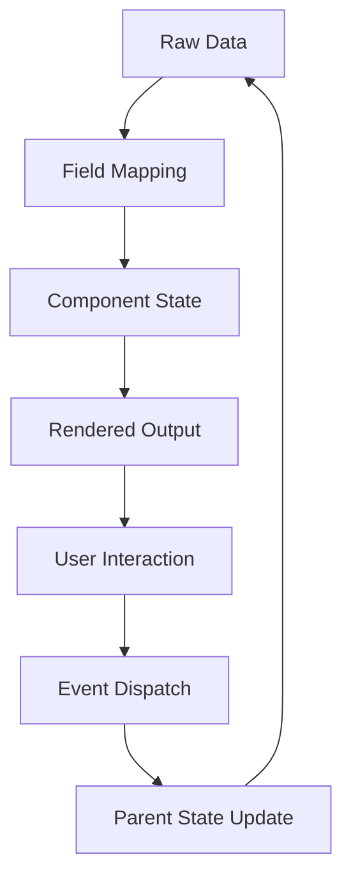

# Rokkit Component Implementation Patterns

## Standard Component Structure

### Base Component Template

Every Rokkit component follows this structural pattern:

```svelte
<script>
  import { FieldMapper } from '@rokkit/core'
  import { createEventDispatcher } from 'svelte'
  
  // Props with defaults
  let {
    items = [],
    value = $bindable(),
    fields = {},
    using = {},
    class: className = '',
    ...restProps
  } = $props()
  
  // Internal state
  let mapping = $derived(new FieldMapper(fields, using))
  let processedItems = $derived(items.map(item => mapping.wrap(item)))
  
  // Event dispatcher
  const dispatch = createEventDispatcher()
  
  // Event handlers
  function handleSelection(item) {
    value = item
    dispatch('select', { value: item })
  }
</script>

<!-- Component markup -->
<div class="rokkit-component {className}" {...restProps}>
  {#each processedItems as item (item.id)}
    <!-- Item rendering -->
  {/each}
</div>
```

### Props Pattern Standardization

**Required Props**:
- `items`: Data array for selection components
- `value`: Current selection (bindable)

**Optional Props**:
- `fields`: Field mapping object
- `using`: Component override object
- `class`: CSS class string
- `disabled`: Boolean state
- `placeholder`: Hint text

**Component-Specific Props**:
- Selection: `multiple`, `clearable`
- Hierarchical: `autoClose`, `expandAll`
- Input: `min`, `max`, `step`

## Data Flow Patterns

### Unidirectional Data Flow



### Field Mapping Implementation

```javascript
// FieldMapper class usage pattern
class ComponentLogic {
  constructor(fields, using) {
    this.mapping = new FieldMapper(fields, using)
  }
  
  processItems(items) {
    return items.map(item => this.mapping.wrap(item))
  }
  
  renderItem(wrappedItem) {
    const Component = this.mapping.getComponent(wrappedItem)
    return { Component, props: this.mapping.getProps(wrappedItem) }
  }
}
```

## Selection Component Pattern

### Core Implementation

```svelte
<script>
  import { SelectionManager } from '@rokkit/core'
  
  let {
    items = [],
    value = $bindable(),
    multiple = false,
    fields = {},
    using = {}
  } = $props()
  
  let selection = $derived(new SelectionManager(items, { multiple }))
  let mapping = $derived(new FieldMapper(fields, using))
  
  function handleItemClick(item) {
    if (multiple) {
      value = selection.toggle(item, value)
    } else {
      value = selection.select(item)
    }
  }
  
  function handleKeyDown(event, item) {
    switch (event.key) {
      case 'Enter':
      case ' ':
        event.preventDefault()
        handleItemClick(item)
        break
      case 'ArrowDown':
        event.preventDefault()
        focusNext()
        break
      case 'ArrowUp':
        event.preventDefault()
        focusPrevious()
        break
    }
  }
</script>

<div role="listbox" aria-multiselectable={multiple}>
  {#each items as item, index (mapping.getId(item))}
    <div
      role="option"
      tabindex={index === 0 ? 0 : -1}
      aria-selected={selection.isSelected(item, value)}
      onclick={() => handleItemClick(item)}
      onkeydown={(e) => handleKeyDown(e, item)}
    >
      {@render itemContent(mapping.wrap(item))}
    </div>
  {/each}
</div>
```

### Multi-Selection Pattern

```svelte
<script>
  // Multi-selection specific logic
  let selectedItems = $derived(Array.isArray(value) ? value : [])
  
  function toggleSelection(item) {
    const isSelected = selectedItems.includes(item)
    if (isSelected) {
      value = selectedItems.filter(i => i !== item)
    } else {
      value = [...selectedItems, item]
    }
  }
  
  function selectAll() {
    value = [...items]
  }
  
  function clearAll() {
    value = []
  }
</script>
```

## Hierarchical Component Pattern

### Tree Structure Implementation

```svelte
<script>
  import { TreeNode } from '@rokkit/core'
  
  let {
    items = [],
    value = $bindable(),
    fields = {},
    autoClose = false
  } = $props()
  
  let treeNodes = $derived(items.map(item => new TreeNode(item, fields)))
  let expandedNodes = $state(new Set())
  
  function toggleExpansion(node) {
    if (expandedNodes.has(node.id)) {
      expandedNodes.delete(node.id)
    } else {
      if (autoClose) {
        expandedNodes.clear()
      }
      expandedNodes.add(node.id)
    }
    expandedNodes = expandedNodes // Trigger reactivity
  }
  
  function selectNode(node) {
    value = node.value
    dispatch('select', { value: node.value, path: node.path })
  }
</script>

{#each treeNodes as node (node.id)}
  <div class="tree-node" data-level={node.level}>
    {#if node.hasChildren}
      <button
        onclick={() => toggleExpansion(node)}
        aria-expanded={expandedNodes.has(node.id)}
      >
        {@render expandIcon(expandedNodes.has(node.id))}
      </button>
    {/if}
    
    <div onclick={() => selectNode(node)}>
      {@render nodeContent(node)}
    </div>
    
    {#if node.hasChildren && expandedNodes.has(node.id)}
      <div class="tree-children">
        {#each node.children as child (child.id)}
          <!-- Recursive rendering -->
          <svelte:self items={[child]} {value} {fields} {autoClose} />
        {/each}
      </div>
    {/if}
  </div>
{/each}
```

## Input Component Pattern

### Form Integration

```svelte
<script>
  import { InputValidator } from '@rokkit/core'
  
  let {
    value = $bindable(),
    name,
    label,
    type = 'text',
    required = false,
    validation = {},
    disabled = false
  } = $props()
  
  let validator = $derived(new InputValidator(validation))
  let errors = $state([])
  let touched = $state(false)
  
  function handleInput(event) {
    value = event.target.value
    if (touched) {
      validateValue()
    }
  }
  
  function handleBlur() {
    touched = true
    validateValue()
  }
  
  function validateValue() {
    errors = validator.validate(value)
  }
  
  $effect(() => {
    if (required && !value) {
      errors = ['This field is required']
    }
  })
</script>

<div class="input-field" class:error={errors.length > 0}>
  {#if label}
    <label for={name}>{label}</label>
  {/if}
  
  <input
    id={name}
    {name}
    {type}
    {value}
    {disabled}
    {required}
    aria-invalid={errors.length > 0}
    aria-describedby={errors.length > 0 ? `${name}-error` : undefined}
    oninput={handleInput}
    onblur={handleBlur}
  />
  
  {#if errors.length > 0}
    <div id="{name}-error" class="error-message">
      {errors[0]}
    </div>
  {/if}
</div>
```

## Snippet Integration Pattern

### Modern Svelte 5 Approach

```svelte
<script>
  let { items, fields, children } = $props()
  let mapping = $derived(new FieldMapper(fields))
</script>

{#each items as item (mapping.getId(item))}
  <div class="item-container">
    {#if children?.stub}
      {@render children.stub(mapping.wrap(item))}
    {:else if children?.[mapping.getComponent(item)]}
      {@render children[mapping.getComponent(item)](mapping.wrap(item))}
    {:else}
      {@render defaultItemRenderer(mapping.wrap(item))}
    {/if}
  </div>
{/each}

{#snippet defaultItemRenderer(node)}
  <Item value={node.value} mapping={node.mapping} />
{/snippet}
```

## Accessibility Pattern

### Standard A11y Implementation

```svelte
<script>
  import { createId, trapFocus } from '@rokkit/core'
  
  let componentId = createId()
  let focusedIndex = $state(0)
  let containerRef = $state()
  
  function handleKeyboard(event) {
    switch (event.key) {
      case 'ArrowDown':
        event.preventDefault()
        focusedIndex = Math.min(focusedIndex + 1, items.length - 1)
        break
      case 'ArrowUp':
        event.preventDefault()
        focusedIndex = Math.max(focusedIndex - 1, 0)
        break
      case 'Home':
        event.preventDefault()
        focusedIndex = 0
        break
      case 'End':
        event.preventDefault()
        focusedIndex = items.length - 1
        break
      case 'Escape':
        containerRef?.blur()
        break
    }
  }
  
  $effect(() => {
    if (containerRef) {
      trapFocus(containerRef)
    }
  })
</script>

<div
  bind:this={containerRef}
  role="listbox"
  aria-label="Select an option"
  aria-activedescendant="{componentId}-option-{focusedIndex}"
  tabindex="0"
  onkeydown={handleKeyboard}
>
  {#each items as item, index (index)}
    <div
      id="{componentId}-option-{index}"
      role="option"
      aria-selected={index === focusedIndex}
      tabindex="-1"
    >
      {mapping.getText(item)}
    </div>
  {/each}
</div>
```

## Performance Optimization Pattern

### Efficient Rendering

```svelte
<script>
  import { VirtualList } from '@rokkit/core'
  
  let {
    items = [],
    itemHeight = 40,
    visibleCount = 10,
    threshold = 100
  } = $props()
  
  // Use virtual scrolling for large datasets
  let useVirtual = $derived(items.length > threshold)
  let virtualList = $derived(
    useVirtual ? new VirtualList(items, { itemHeight, visibleCount }) : null
  )
  
  let visibleItems = $derived(
    useVirtual ? virtualList.getVisibleItems() : items
  )
</script>

{#if useVirtual}
  <div
    class="virtual-container"
    style="height: {virtualList.totalHeight}px"
    onscroll={(e) => virtualList.handleScroll(e.target.scrollTop)}
  >
    <div style="transform: translateY({virtualList.offsetY}px)">
      {#each visibleItems as item (item.id)}
        {@render itemContent(item)}
      {/each}
    </div>
  </div>
{:else}
  {#each items as item (item.id)}
    {@render itemContent(item)}
  {/each}
{/if}
```

## Testing Pattern

### Component Test Structure

```javascript
import { render, fireEvent } from '@testing-library/svelte'
import { expect, test, describe } from 'vitest'
import Component from './Component.svelte'

describe('Component', () => {
  const mockItems = [
    { id: 1, name: 'Item 1' },
    { id: 2, name: 'Item 2' }
  ]
  
  test('renders items correctly', () => {
    const { getByText } = render(Component, {
      props: { items: mockItems }
    })
    
    expect(getByText('Item 1')).toBeInTheDocument()
    expect(getByText('Item 2')).toBeInTheDocument()
  })
  
  test('handles selection', async () => {
    let selectedValue
    const { getByText } = render(Component, {
      props: { 
        items: mockItems,
        value: selectedValue
      }
    })
    
    await fireEvent.click(getByText('Item 1'))
    expect(selectedValue).toBe(mockItems[0])
  })
  
  test('supports field mapping', () => {
    const customItems = [{ title: 'Custom Item' }]
    const { getByText } = render(Component, {
      props: {
        items: customItems,
        fields: { text: 'title' }
      }
    })
    
    expect(getByText('Custom Item')).toBeInTheDocument()
  })
  
  test('keyboard navigation works', async () => {
    const { container } = render(Component, {
      props: { items: mockItems }
    })
    
    const listbox = container.querySelector('[role="listbox"]')
    
    await fireEvent.keyDown(listbox, { key: 'ArrowDown' })
    // Test focus movement
    
    await fireEvent.keyDown(listbox, { key: 'Enter' })
    // Test selection
  })
})
```

## Documentation Pattern

### Component API Documentation

```typescript
/**
 * Flexible list component for displaying and selecting items
 * 
 * @example
 * ```svelte
 * <List items={users} fields={{ text: 'name' }} bind:value />
 * ```
 */
interface ListProps<T = any> {
  /** Array of items to display */
  items: T[]
  
  /** Currently selected item */
  value?: T | null
  
  /** Field mapping configuration */
  fields?: FieldMapping
  
  /** Custom component overrides */
  using?: ComponentMap
  
  /** Enable multiple selection */
  multiple?: boolean
  
  /** Additional CSS classes */
  class?: string
}

interface ListEvents<T = any> {
  /** Fired when an item is selected */
  select: CustomEvent<{ value: T }>
  
  /** Fired when selection changes */
  change: CustomEvent<{ value: T | T[] }>
  
  /** Fired when focus moves between items */
  move: CustomEvent<{ index: number, value: T }>
}

interface ListSlots {
  /** Custom header content */
  header: {}
  
  /** Custom footer content */  
  footer: {}
  
  /** Empty state content */
  empty: {}
  
  /** Custom item renderer */
  stub: { node: WrappedNode }
}
```
