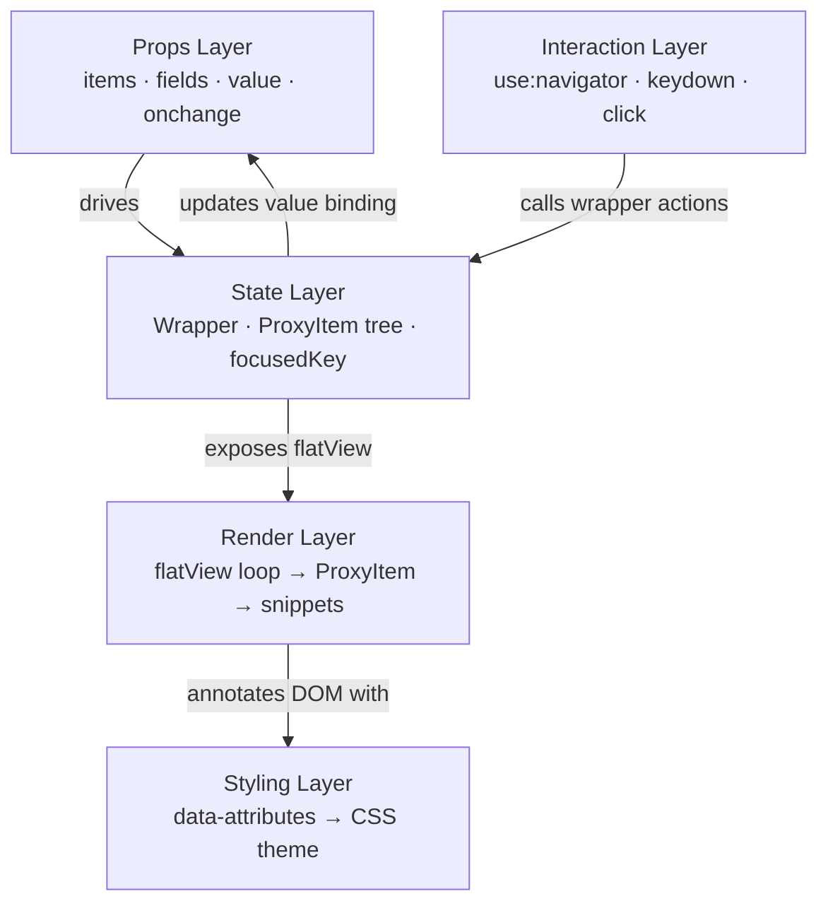
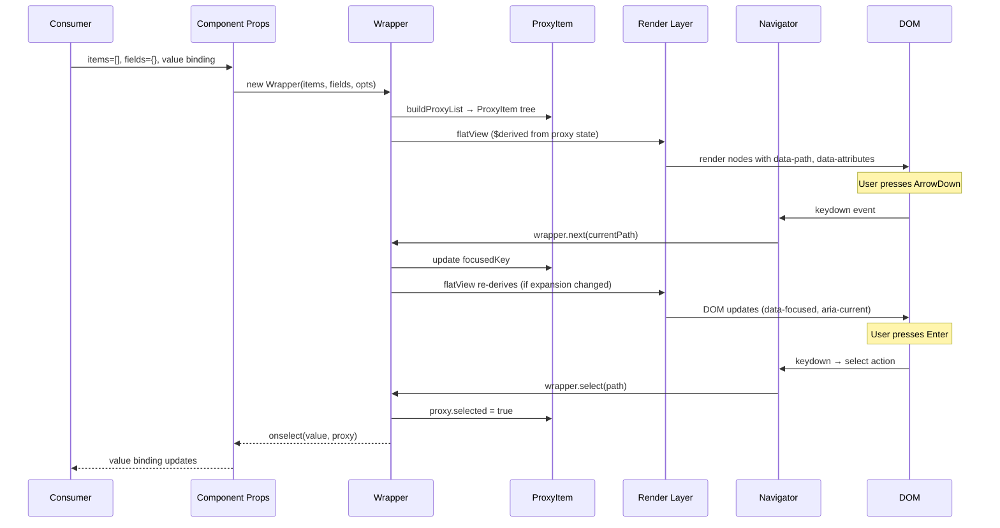
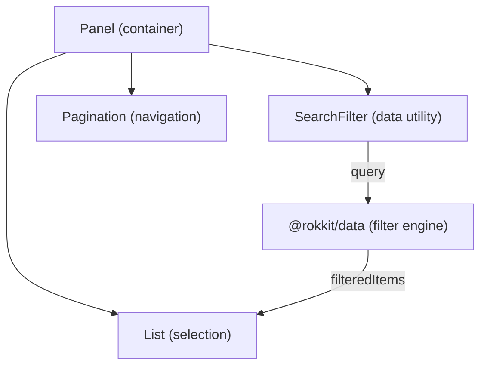
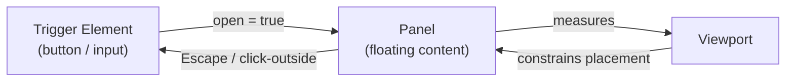

# Component System

> How Rokkit components are structured, composed, and interact — the design contract
> for component developers building on or for Rokkit.

---

## Design Philosophy

### Single-Component Model

Data-driven components in Rokkit follow a **single-component model**. A consumer uses one
tag — `<List>`, `<Select>`, `<Tree>` — and passes data. There are no compound component APIs
like `<List.Root><List.Item /></List.Root>`. This is a deliberate choice.

Compound APIs push structural concerns into the consumer's template. They require the
consumer to know which child components to assemble, in what order, with what props. For
data-driven use cases — where items come from an array, not from markup — this is the wrong
abstraction. The component should accept data and render it; the consumer should not be
responsible for iterating it.

Single-component design means:

- One import per component.
- Data goes in as props; selection comes back as a binding or callback.
- The internal rendering structure (groups, separators, items) is inferred from the data.
- Customization happens through snippets and field mapping, not through child components.

### Composition Over Configuration

The single-component model does not mean components grow to absorb every feature. The
opposite constraint applies: **a component does the minimum required for its job**.

A `List` renders items and manages selection. It does not search, paginate, or sort. Those
concerns belong to separate composable components that the application wires together. When
a feature does not belong to a component's core job, it is not added as a prop — it is left
for composition at the application layer.

This constraint produces smaller, more focused components that are individually testable and
independently reusable. A `SearchFilter` composed with a `List` is more flexible than a
`List` with a `searchable` prop, because the same `SearchFilter` can be composed with a
`Tree`, a `Table`, or a `Grid`.

### The Minimum-Viable Component

The question for any new component is: what is the smallest surface that fulfills this
component's contract?

For selection components the answer is: accept items, reflect selection, and support
keyboard navigation. Everything else — filtering, grouping headers, pagination, custom
rendering — is handled by composition or snippets. For input components the answer is:
capture the value, expose validation state, and integrate with form bindings. For overlay
components: open, position, and close.

---

## Component Anatomy

Every data-driven component is built from the same five layers. These layers are not
independent files — they are design responsibilities that live together in a single
component but remain cleanly separated in how they interact.



### Props Layer

The props layer is the public API. It accepts raw data (`items`), describes how to interpret
it (`fields`), carries current selection (`value`), and communicates changes back
(`onchange`). Props are the only surface a consumer interacts with. The props layer does
not perform computation — it passes data down.

### State Layer

The state layer owns all reactive state for the component. It is implemented by a Wrapper
(such as `ListWrapper`), which in turn builds and manages a tree of ProxyItems. The Wrapper
exposes:

- `flatView` — a derived, flat, ordered array of currently-visible nodes used for rendering.
- `focusedKey` — the key of the item that currently has logical focus.
- Navigation and selection actions (`next`, `prev`, `select`, `expand`, `collapse`, etc.)
  that the interaction layer calls.

ProxyItems are the reactive model for individual items. Each ProxyItem wraps a raw data
item and exposes uniform accessors (`.text`, `.value`, `.icon`, `.disabled`, `.expanded`)
derived through the field map. ProxyItems own `expanded` and `selected` as Svelte `$state`,
which means the `flatView` derivation re-computes automatically when any group is expanded
or collapsed — no manual sync is needed.

### Render Layer

The render layer is a flat loop over `wrapper.flatView`. It does not build nested structures
in markup. Group/child relationships are already encoded in the flatView by the Wrapper:
when a group is collapsed its children are absent from flatView; when expanded they appear
inline. Each node in flatView carries its depth level for CSS indentation.

For each node the render layer either uses the default template or yields control to a
consumer-provided snippet. The snippet always receives the ProxyItem, giving the consumer
access to all mapped fields and state without exposing the raw data structure.

### Interaction Layer

The interaction layer is the `use:navigator` action applied to the component's root element.
Navigator listens for `keydown` and `click` events on the container, translates them to
semantic actions (next, prev, select, expand, collapse), and calls the corresponding method
on the Wrapper. Navigator is not coupled to any component: it operates on the `IWrapper`
interface and works with any conforming Wrapper implementation.

The component itself does not add `onclick` handlers to individual items. Navigator
intercepts all clicks on elements marked with `data-path`. Individual items remain inert
from the event perspective — all routing flows through Navigator → Wrapper → state update
→ reactive re-render.

### Styling Layer

The styling layer is the set of `data-*` attributes placed on DOM elements by the render
layer. These attributes form a stable contract between the component and CSS themes. No
class names are used for state. No element type selectors are used in themes. The full
contract is defined in Section 7.

---

## Component Categories

### Selection Components

**List, Select, MultiSelect, Tree, Toggle**

Selection components are the core of Rokkit's data-driven model. They all share the
ProxyItem + Wrapper + Navigator architecture. The distinguishing design considerations are:

**List** — a persistent, vertically-oriented selection surface. Items remain visible at all
times. Supports flat and grouped item structures, with optional collapsible groups. The
simplest selection component; the others build on or adapt its design.

**Select** — wraps a List inside a Dropdown. The trigger shows the current selection. The
panel contains a List. Opening, positioning, and closing the panel is the Dropdown's
responsibility; item selection is the List's. The Select composes these two concerns rather
than merging them.

**MultiSelect** — extends Select for multiple selection. The trigger displays selected items
as removable pills. The internal List uses the extend/range selection actions. The `value`
binding is an array of extracted primitives; the `onchange` callback receives both the array
and the corresponding full items.

**Tree** — a persistent hierarchical selection surface. Uses a NestedController-aware
Wrapper. Arrow keys expand and collapse nodes in addition to moving focus. Keyboard
semantics follow the WAI-ARIA tree pattern: ArrowRight expands or descends, ArrowLeft
collapses or ascends to parent. The `value` binding holds the selected leaf's value; group
nodes are not selectable.

**Toggle** — a horizontally-oriented exclusive selection surface. Designed for small option
sets (view modes, time periods, orientations). Uses ListController with horizontal navigator
orientation. Each option is a focusable button; only one is active at a time.

### Navigation Components

**Tabs, Menu, Toolbar**

Navigation components move the user between views or actions. They share the horizontal
navigator orientation but differ in their destination and lifecycle.

**Tabs** — a persistent horizontal navigation surface that controls panel visibility. The
tab list uses horizontal arrow-key navigation. Selecting a tab changes the active panel;
the previously active panel is hidden. The `value` binding holds the active tab's
identifier.

**Menu** — a contextual action list presented in a Dropdown. Unlike Select, Menu items
represent actions rather than values: activating an item fires a callback and closes the
menu. Supports grouped items with visual separators. Keyboard navigation follows the
WAI-ARIA menu pattern.

**Toolbar** — a horizontal row of controls (buttons, toggles, dividers). Toolbar applies
the horizontal navigator to its children, enabling arrow-key traversal between controls.
Separators and spacers are visually present but excluded from the focus order.

### Input Components

**Input, Checkbox, Switch**

Input components are form-integrated primitives. They do not use the ProxyItem + Wrapper
stack because they operate on scalar values, not item arrays. Each participates in Svelte
form bindings (`bind:value`, `bind:checked`) and in the Rokkit form system.

Inputs expose `disabled`, `class`, and validation state (`data-state="error"` /
`data-state="success"`). They are not data-driven but they follow the same data-attribute
styling contract as all other components.

### Overlay Components

**Dropdown, Popover**

Overlay components layer content above the page. They manage positioning relative to a
trigger, focus trapping within the panel, and dismissal via Escape or outside click. The
design of overlays is covered in detail in Section 9.

### Cards

Cards are a surface container, not a data-driven selection component. A Card provides
elevation, border, and background — a visual grouping container. When a Card is made
selectable, it gains interactive states (`data-selected`, `data-focused`) and participates
in keyboard navigation via the standard button/interactive element pattern. Card content is
entirely defined by snippets; the Card imposes no opinion on its internal layout.

### Layout Components

**Stack, Grid, Divider**

Layout components are structural and carry no interactive behavior. They exist to provide
consistent spatial arrangements — row/column stacking with configurable gaps, responsive
grid columns, and visual dividers. Layout components do not carry data-attribute state
hooks beyond their root marker. They are not theme targets for interactive states.

---

## Data Flow Through a Component

The following diagram traces the full lifecycle from consumer input to DOM output and back.



The key properties of this flow:

- **Data flows down** through props into the Wrapper. The Wrapper never reaches back to
  the component's reactive scope — it operates only on what it was constructed with.
- **Actions flow up** from DOM events through Navigator to Wrapper methods. Navigator
  does not know about the component; it knows only the `IWrapper` interface.
- **State is owned by ProxyItems**. The component's template does not maintain its own
  expanded/selected state. It reads `proxy.expanded` and `proxy.selected` directly.
- **flatView is derived**. When any ProxyItem's `expanded` state changes, `flatView`
  re-computes automatically. The render layer re-runs its loop without any manual
  notification.
- **value binding is the output**. The final output of a user interaction is the update
  to the `value` binding and the invocation of the `onchange` or `onselect` callback.

---

## API Conventions

Every selection component exposes the same foundational props. Developers familiar with
one component can adopt any other with minimal learning.

### Standard Props

| Prop       | Type                    | Bindable | Description                                                                                                |
| ---------- | ----------------------- | -------- | ---------------------------------------------------------------------------------------------------------- |
| `items`    | `unknown[]`             | No       | The data array. Items may be objects or primitives.                                                        |
| `value`    | `unknown`               | Yes      | The extracted value-field primitive of the selected item. For MultiSelect, an array of primitives.         |
| `fields`   | `FieldConfig`           | No       | Maps semantic field names to raw data keys. Partial — overrides default field map.                         |
| `onchange` | `(value, item) => void` | No       | Fired when the selection is committed. Receives the extracted value and the original item.                 |
| `onselect` | `(value, item) => void` | No       | Fired when an item is highlighted (not yet committed). Used for preview or hover effects.                  |
| `disabled` | `boolean`               | No       | Disables the entire component. No interaction, visually muted.                                             |
| `class`    | `string`                | No       | CSS class appended to the component's root element. Used for layout constraints (width, height, overflow). |
| `icons`    | `StateIcons`            | No       | Per-instance overrides for component state icons (expand/collapse arrows, etc.).                           |
| `labels`   | `Labels`                | No       | Per-instance overrides for component ARIA labels and visible text.                                         |

### Field Mapping Defaults

The `fields` prop is always partial. When a key is omitted, the component uses its default.
The default field map for all selection components is:

| Semantic Name | Default Raw Key | Description                                       |
| ------------- | --------------- | ------------------------------------------------- |
| `text`        | `label`         | Display text                                      |
| `value`       | `value`         | Extracted selection value                         |
| `icon`        | `icon`          | Icon class name                                   |
| `href`        | `href`          | Navigation URL (renders as `<a>`)                 |
| `description` | `description`   | Secondary text                                    |
| `children`    | `children`      | Array of child items (hierarchical)               |
| `type`        | `type`          | Item type: `item`, `group`, `separator`, `spacer` |
| `disabled`    | `disabled`      | Item-level disabled state                         |
| `expanded`    | `expanded`      | Initial/synced expansion state                    |
| `snippet`     | `snippet`       | Named snippet override for this item              |

### Value Binding Contract

The `value` binding always holds the **extracted value-field primitive** — the result of
`item[fields.value]`. It is not the full item object. This matches native `<select>`
semantics and allows `bind:value={selectedId}` patterns.

When the full item object is needed, it is available as the second argument of `onchange`
and `onselect`. For MultiSelect, both arguments are arrays.

For primitive item arrays (e.g., `['day', 'week', 'month']`), the item itself is the
extracted value, so `bind:value={period}` binds directly to the string.

### Additional Bindable Props

Some components expose secondary bindable props alongside `value`:

| Prop       | Component           | Description                                                              |
| ---------- | ------------------- | ------------------------------------------------------------------------ |
| `selected` | Select, MultiSelect | The full selected item object(s). Convenience alternative to `onchange`. |
| `open`     | Select, Dropdown    | Controls panel open/closed state.                                        |
| `expanded` | Tree                | Tracks expansion state for external sync.                                |

---

## Snippet Model

Snippets are the primary customization mechanism for rendering. They replace the default
item template without affecting the component's behavior, selection, or keyboard
navigation.

### Available Snippet Slots

| Snippet Name   | When Invoked                                | Receives                  |
| -------------- | ------------------------------------------- | ------------------------- |
| `itemContent`  | Every leaf item (non-group)                 | `ProxyItem`               |
| `groupContent` | Every group header                          | `ProxyItem`               |
| `empty`        | When `items` is empty or all items filtered | Nothing                   |
| `[name]`       | Items with `item.snippet === name`          | `ProxyItem` for that item |

The named snippet slot allows per-item rendering variation without a conditional inside the
snippet. If an item carries `snippet: 'featured'`, the component looks for a `{#snippet
featured(proxy)}` before falling back to `itemContent`.

### Snippet Resolution Order

For each item during render:

1. Check `proxy.get('snippet')` — does this item name a specific snippet?
2. If yes, look for `snippets[name]`. If found, use it.
3. Fall back to `snippets['itemContent']` (or `groupContent` for groups).
4. If neither exists, render the component's default content.

This resolution is performed by the `resolveSnippet` utility from `@rokkit/core`. Components
use a consistent pattern:

```svelte
{@const snippet = resolveSnippet($$snippets, proxy, 'itemContent') ?? defaultContent}
{@render snippet(proxy)}
```

### What ProxyItem Exposes to Snippets

Snippets receive the ProxyItem, not the raw item. This provides:

| Property        | Type      | Description                                  |
| --------------- | --------- | -------------------------------------------- |
| `.text`         | `string`  | Display label (field-mapped)                 |
| `.value`        | `unknown` | Extracted value primitive                    |
| `.icon`         | `string?` | Icon class string                            |
| `.href`         | `string?` | Navigation URL                               |
| `.disabled`     | `boolean` | Non-interactive state                        |
| `.expanded`     | `boolean` | Group expansion state                        |
| `.selected`     | `boolean` | Selection state                              |
| `.level`        | `number`  | Nesting depth (1 = root)                     |
| `.get('field')` | `unknown` | Access any field by semantic name or raw key |
| `.raw`          | `unknown` | Escape hatch to original item object         |

Snippets must not mutate `proxy.raw` directly for state purposes. For interactive elements
within a snippet (e.g., a checkbox inside a list item), mutations should be applied to
`proxy.value` (which is a reference to the original item object) and click events should
call `stopPropagation()` to prevent the Navigator from treating the interaction as a
selection.

### Partial Overrides

Snippets are always opt-in. Providing an `itemContent` snippet overrides all leaf items;
not providing one leaves the default rendering intact. Named snippets can override a subset
of items while leaving the rest at default. There is no requirement to provide all snippet
slots — they compose independently.

---

## Data Attribute Contract

Every Rokkit component annotates its DOM using `data-*` attributes. These attributes are
the sole interface between component structure and CSS themes. No class names are used for
state; no element type selectors are used in theme CSS.

### Root Marker

Every component root has a single identifying marker:

| Component   | Root Attribute     |
| ----------- | ------------------ |
| List        | `data-list`        |
| Select      | `data-select`      |
| MultiSelect | `data-multiselect` |
| Tree        | `data-tree`        |
| Toggle      | `data-toggle`      |
| Tabs        | `data-tabs`        |
| Menu        | `data-menu`        |
| Toolbar     | `data-toolbar`     |
| Dropdown    | `data-dropdown`    |
| Card        | `data-card`        |

### Sub-Element Markers

Child elements use the `data-{component}-{role}` pattern:

| Element        | Attribute             | Description                   |
| -------------- | --------------------- | ----------------------------- |
| Leaf item      | `data-list-item`      | Selectable item               |
| Group header   | `data-list-group`     | Collapsible group trigger     |
| Separator      | `data-list-separator` | Visual divider, not focusable |
| Spacer         | `data-list-spacer`    | Flexible space, not focusable |
| Select trigger | `data-select-trigger` | Displays current selection    |
| Select panel   | `data-select-panel`   | Dropdown container            |
| Tab item       | `data-tabs-tab`       | Individual tab button         |
| Tab panel      | `data-tabs-panel`     | Panel associated with tab     |

### Boolean State Attributes

Boolean state uses **presence vs. absence** — not `="true"`/`="false"`. An attribute is
present when the state is active; absent otherwise.

| Attribute       | Meaning when present                    |
| --------------- | --------------------------------------- |
| `data-active`   | Item is the current selection           |
| `data-focused`  | Item has logical keyboard focus         |
| `data-disabled` | Item or component is non-interactive    |
| `data-expanded` | Group node is expanded                  |
| `data-selected` | Item is selected (multi-select context) |
| `data-open`     | Overlay panel is open                   |

### Value State Attributes

Enumerated states use `data-{attr}="{value}"`:

| Attribute          | Values                              | Description                   |
| ------------------ | ----------------------------------- | ----------------------------- |
| `data-variant`     | `default`, `ghost`, `outline`, …    | Visual variant                |
| `data-size`        | `sm`, `md`, `lg`                    | Size modifier                 |
| `data-density`     | `compact`, `default`, `comfortable` | Spacing density               |
| `data-orientation` | `horizontal`, `vertical`            | Layout axis                   |
| `data-state`       | `error`, `success`, `warning`       | Validation state (inputs)     |
| `data-level`       | integer ≥ 1                         | Nesting depth for indentation |

### Navigation Attributes

| Attribute   | Element              | Description                                                                                              |
| ----------- | -------------------- | -------------------------------------------------------------------------------------------------------- |
| `data-path` | Every focusable item | Key string used by Navigator for click detection and scroll targeting. Format: `'0'`, `'0-1'`, `'0-1-2'` |

### CSS Theme Convention

Theme stylesheets select exclusively by data attributes:

```css
/* Correct — data-attribute selectors */
[data-list-item][data-active] { background: var(--color-accent); }
[data-list-item][data-disabled] { opacity: 0.5; pointer-events: none; }
[data-list][data-density="compact"] [data-list-item] { padding: 0.25rem 0.5rem; }

/* Never — class or element selectors */
.list-item.active { ... }
rk-item { ... }
```

This contract means themes are fully decoupled from component internals. A theme can be
written against the attribute contract without access to component source, and a component
can be restructured internally without breaking themes as long as the attribute contract is
preserved.

---

## Composition Pattern

### The Anti-Pattern: Feature Creep

The most common mistake in component library design is accumulating props:

```svelte
<!-- Anti-pattern: one component absorbing unrelated concerns -->
<List
  items={data}
  searchable={true}
  sortable={true}
  header="Results"
  footer={pagination}
  emptyMessage="No results found"
/>
```

This approach couples unrelated behaviors, bloats the component API, makes each behavior
harder to test in isolation, and prevents reuse of any individual behavior with other
components.

### The Correct Pattern: Composition

Instead, each concern lives in its own component. Application code composes them:

```svelte
<!-- Correct pattern: focused components composed at the application layer -->
<Panel>
  {#snippet header()}
    <SearchFilter bind:query onfilter={handleFilter} />
  {/snippet}

  <List items={filteredItems} bind:value />

  {#snippet footer()}
    <Pagination {totalCount} bind:page />
  {/snippet}
</Panel>
```



In this pattern:

- `Panel` provides layout — header, body, footer slots with consistent spacing.
- `SearchFilter` encapsulates the search input and filter state. It works equally well
  above a `Tree`, a `Table`, or any other data-driven component.
- `List` renders the filtered items and manages selection. It knows nothing about search.
- `Pagination` manages page state. It knows nothing about List or Search.
- `@rokkit/data` contains the filtering logic. It is a utility, not a component.

Each piece is independently testable and independently reusable.

### Composition Boundaries

A component may embed another Rokkit component when the relationship is fixed and universal.
For example, `Select` always contains a `Dropdown` and a `List` — there is no configuration
where it would not. This internal composition is acceptable because it does not leak into
the consumer API.

A component must not embed a concern that is optional or application-specific. Filtering,
pagination, column visibility, and row grouping belong to the application layer.

---

## Overlay Design

### Trigger + Panel Model

All overlay components follow the same fundamental model: a **trigger** and a **panel**.

- The trigger is any interactive element that opens the overlay. It may be a button, an
  input, or any focusable element. The trigger owns the `open` state.
- The panel is the floating content that appears above the page when `open` is true. It
  is positioned relative to the trigger by the overlay infrastructure.



The trigger and panel are always siblings in the DOM — the panel is never a child of the
trigger element. This preserves correct accessibility relationships and avoids stacking
context problems.

### Viewport-Aware Placement

When the panel opens, the overlay measures the available space around the trigger and
chooses its placement:

**Vertical axis (direction):**

| Value  | Behavior                                           |
| ------ | -------------------------------------------------- |
| `down` | Panel opens below the trigger (default)            |
| `up`   | Panel opens above the trigger                      |
| `auto` | Compares space above and below; selects the larger |

**Horizontal axis (alignment):**

| Value    | Behavior                                        |
| -------- | ----------------------------------------------- |
| `start`  | Panel left edge aligns with trigger left edge   |
| `center` | Panel centered on the trigger                   |
| `end`    | Panel right edge aligns with trigger right edge |

Placement is calculated at open time and may shift if the viewport is scrolled or resized
while the panel is open. The panel does not overflow the viewport — if the calculated
position would cause overflow, it shifts toward the center.

### Focus Trapping

When a panel opens, keyboard focus moves into the panel. Tab and Shift+Tab cycle through
focusable elements inside the panel. Focus cannot escape to the page behind the panel while
it is open. This is handled by the `dismissable` action.

When the panel closes, focus returns to the trigger element that opened it.

### Dismissal

Overlay panels close on:

- **Escape key** — any time the panel is open.
- **Click outside** — clicking anywhere outside the trigger or panel.
- **Item selection** (for Dropdowns used as Select or Menu) — selecting an item closes the
  panel as part of the commitment action.

Escape and click-outside are handled by document-level listeners applied by the
`dismissable` action. They are not attached to the panel itself, ensuring they fire even
when focus is deep inside the panel's content.

### Select vs. Menu: Same Overlay, Different Semantics

Both `Select` and `Menu` use the Dropdown overlay. The distinction is in what happens on
item selection:

- **Select**: selection commits a value. The `value` binding updates; the panel closes.
- **Menu**: selection fires an action callback. No value is committed; the panel closes.

The Dropdown is unaware of this distinction. It provides the open/close lifecycle and
positioning. The List inside the Dropdown handles the semantic difference through the
`onselect` callback's behavior.

---

## Component Development Guide

When building a new component, move through six phases in order. Each phase produces a concrete artifact.

### Phase 1: Classification

Categorize the component before writing any code:

- **Data-driven** — accepts an `items` array, renders it via field mapping, manages selection state
- **Input primitive** — operates on a scalar value, participates in form bindings
- **Overlay** — manages positioning relative to a trigger and open/close lifecycle
- **Layout** — structural container with no interactive state

The category determines which architecture pattern applies (ProxyItem+Wrapper+Navigator, scalar binding, Trigger+Navigator, or none).

### Phase 2: Design

Define the public interface before implementation:

- Props, types, and defaults
- Events and callbacks (`onchange`, `onselect`)
- Snippet slots for customization
- Data flow: input format → internal state → output events
- Keyboard interactions and ARIA roles

### Phase 3: Implementation

- Create a `types.js` with JSDoc types; export from package index
- Apply `data-*` attributes for all structural elements and states
- Apply ARIA attributes alongside data attributes (dual-attribute principle)
- No internal CSS — components are unstyled; themes provide all visual style
- Wire `use:navigator` for keyboard interaction; do not add manual key handlers

Standard component script structure:

```svelte
<script>
  let {
    items = [],
    fields = {},
    value = $bindable(),
    disabled = false,
    class: className = '',
    onchange,
    onselect
    // snippets...
  } = $props()

  // State layer — controller/wrapper
  // Derived state — flatView
  // No manual key handlers
</script>
```

### Phase 4: Styling

Define all data attribute hooks before writing theme CSS:

| Pattern           | Example                                                         |
| ----------------- | --------------------------------------------------------------- |
| Component root    | `data-list`, `data-tree`, `data-select`                         |
| Sub-elements      | `data-list-item`, `data-tree-node`                              |
| Boolean states    | `data-active`, `data-focused`, `data-disabled`, `data-expanded` |
| Enumerated values | `data-variant="filled"`, `data-size="sm"`                       |

Theme CSS targets only these data attributes — never class names or element type selectors.

### Phase 5: Testing

- Unit tests: rendering with various props, event firing, keyboard navigation, edge cases
- Accessibility tests: correct ARIA attributes, focus management
- E2E tests: realistic usage examples in the learn site

### Phase 6: Documentation

Create `llms.txt` covering: quick start, all props, events, keyboard shortcuts, accessibility notes, data attribute reference, and progressive examples.

---

## ARIA Pattern Reference

Every interactive component provides both data-attribute styling hooks and ARIA attributes. They are always set together — visual state and semantic state never diverge.

### ARIA Roles by Component Type

| Component | Container Role | Item Role  | Key ARIA Attributes                            |
| --------- | -------------- | ---------- | ---------------------------------------------- |
| List      | `listbox`      | `option`   | `aria-selected`, `aria-activedescendant`       |
| Tree      | `tree`         | `treeitem` | `aria-expanded`, `aria-level`, `aria-selected` |
| Menu      | `menu`         | `menuitem` | `aria-haspopup`, `aria-expanded`               |
| Tabs      | `tablist`      | `tab`      | `aria-selected`, `aria-controls`               |
| Grid      | `grid`         | `gridcell` | `aria-selected`                                |
| Select    | `combobox`     | —          | `aria-expanded`, `aria-haspopup`               |
| Toggle    | `listbox`      | `option`   | `aria-selected`, `aria-orientation`            |
| Toolbar   | `toolbar`      | —          | `aria-orientation`                             |

### Required ARIA Pattern

```html
<!-- Container — orientation and label -->
<div role="listbox" aria-label="Choose a country" aria-orientation="vertical">
  <!-- Items — state reflects controller -->
  <div
    role="option"
    aria-selected="true"
    aria-disabled="false"
    data-list-item
    data-active
    data-path="0"
  >
    Content
  </div>
</div>
```

### Keyboard Interaction by Pattern

| Component | Navigation Keys                              | Selection Keys |
| --------- | -------------------------------------------- | -------------- |
| List      | Up/Down                                      | Enter, Space   |
| Tree      | Up/Down (move), Left/Right (collapse/expand) | Enter, Space   |
| Tabs      | Left/Right (or Up/Down for vertical)         | Auto on focus  |
| Menu      | Up/Down                                      | Enter          |
| Grid      | All four arrows                              | Enter, Space   |

---

## Composite Widget Pattern

Dropdown components — Menu, Select, MultiSelect, Combobox — have two distinct interactive zones that must coordinate state:

```
┌───────────────────────────┐
│  Trigger (always visible) │  button or input that opens the panel
│  click → open()           │
│  Enter/Space → open()     │
│  Escape → close()         │
└───────────────────────────┘
         ↕ shared Wrapper
┌───────────────────────────┐
│  Dropdown (when open)     │  list of options
│  use:navigator attached   │  ← Navigator lives HERE only
└───────────────────────────┘
```

The Wrapper is the coordination point. It owns the `open` state and exposes `cancel()` and `blur()` hooks that Navigator calls when Escape is pressed or focus leaves the dropdown:

```javascript
class MenuWrapper extends ListWrapper {
  #open = $state(false)

  open() {
    this.#open = true
  }
  close() {
    this.#open = false
    this.#triggerEl?.focus()
  }

  cancel(_path) {
    this.close()
  } // Escape key
  blur() {
    this.close()
  } // focus left dropdown
}
```

Navigator is only constructed when the dropdown is open and attached to the dropdown element, not the trigger. When the dropdown closes, Navigator is destroyed. This keeps each class focused: `Trigger` never reads item state; `Navigator` never manages open/close.

| Component   | Trigger           | Navigator target | Wrapper subclass     |
| ----------- | ----------------- | ---------------- | -------------------- |
| List        | none (persistent) | root element     | `ListWrapper`        |
| Tree        | none (persistent) | root element     | `ListWrapper`        |
| Menu        | `<button>`        | dropdown `<ul>`  | `MenuWrapper`        |
| Select      | `<button>`        | dropdown `<ul>`  | `SelectWrapper`      |
| MultiSelect | `<button>`        | dropdown `<ul>`  | `MultiSelectWrapper` |
| Combobox    | `<input>`         | dropdown `<ul>`  | `ComboboxWrapper`    |

---

## Upload System Design

### UploadTarget

`UploadTarget` is a drop zone component. It exposes a drag-and-drop surface and a hidden `<input type="file">`. When files are dropped or selected, it validates each file and fires `onfiles(File[])` with the valid files. Invalid files trigger `onerror({ file, reason })` instead.

Validation logic:

```javascript
function validateFile(file) {
  if (accept && !matchesAccept(file, accept)) {
    onerror?.({ file, reason: 'type' })
    return false
  }
  if (file.size > maxSize) {
    onerror?.({ file, reason: 'size' })
    return false
  }
  return true
}

function handleFiles(fileList) {
  const valid = [...fileList].filter(validateFile)
  if (valid.length) onfiles?.(valid)
}
```

`matchesAccept` handles MIME wildcards (`image/*`), extensions (`.pdf`), and exact MIME types (`application/json`).

Data attributes: `data-upload-target`, `data-dragging` (while files hover over drop zone), `data-disabled`.

### Grid Component as Navigator

`Grid` is a general-purpose tile grid that follows the same Wrapper + Navigator pattern as List and Toggle. It uses horizontal navigator orientation with CSS Grid layout:

```svelte
<div
  data-grid
  role="grid"
  use:navigator={{ wrapper, orientation: 'horizontal' }}
  style:--grid-min-size={minSize}
>
  {#each wrapper.flatView as node (node.key)}
    <button
      data-grid-item
      data-path={node.key}
      data-active={wrapper.isSelected(node.key) || undefined}
      role="gridcell"
      aria-selected={wrapper.isSelected(node.key)}
    >
      {#if itemContent}
        {@render itemContent(node.proxy)}
      {/if}
    </button>
  {/each}
</div>
```

CSS layout:

```css
[data-grid] {
  display: grid;
  grid-template-columns: repeat(auto-fill, minmax(var(--grid-min-size, 120px), 1fr));
  gap: var(--grid-gap, 1rem);
}
```

Keyboard: ArrowRight → next, ArrowLeft → prev, Home → first, End → last, Enter/Space → select. Navigation wraps at row edges naturally since items are in DOM order.

### UploadProgress

`UploadProgress` is a composition component. It delegates rendering to List, Tree, or Grid depending on the active view mode (`list`, `tree`, `grid`). The consumer passes a reactive `files` array; `UploadProgress` provides field mapping, view toggle, and status summary. The consumer owns upload logic, status updates, and progress tracking — `UploadProgress` only displays state.

For tree view, the flat file array is grouped by the `path` field into a nested folder structure using a `$derived` transformation.

---

## Theme System Architecture

The full theme system design is in `docs/design/10-theming.md`. The key principle for component authors:

1. Apply `data-*` attributes for every meaningful element and state
2. Use semantic color shortcuts (`bg-surface-z2`, `text-primary-z8`) — never hardcoded colors
3. Never write CSS inside component files — all visual style lives in theme files under `packages/themes/src/`

Theme CSS targets data attributes exclusively:

```css
[data-list-item][data-active] {
  background: var(--color-primary-z2);
}
[data-list-item][data-disabled] {
  opacity: 0.5;
  pointer-events: none;
}
[data-list][data-density='compact'] [data-list-item] {
  padding: 0.25rem 0.5rem;
}
```
