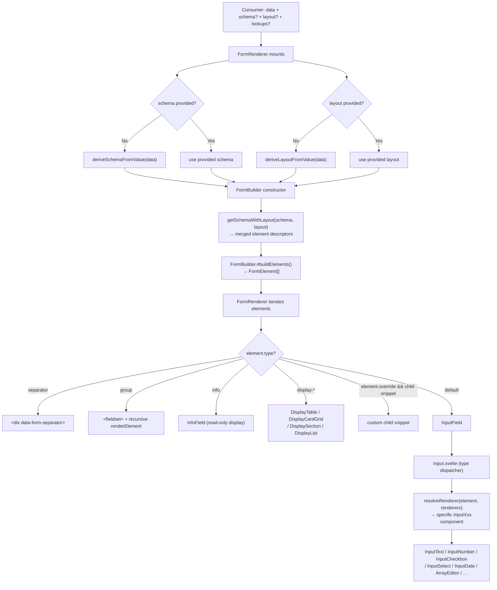
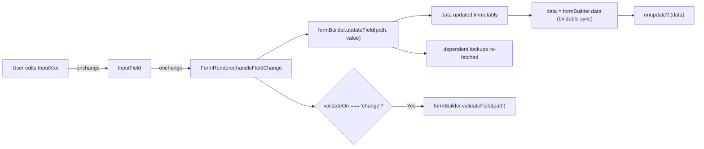
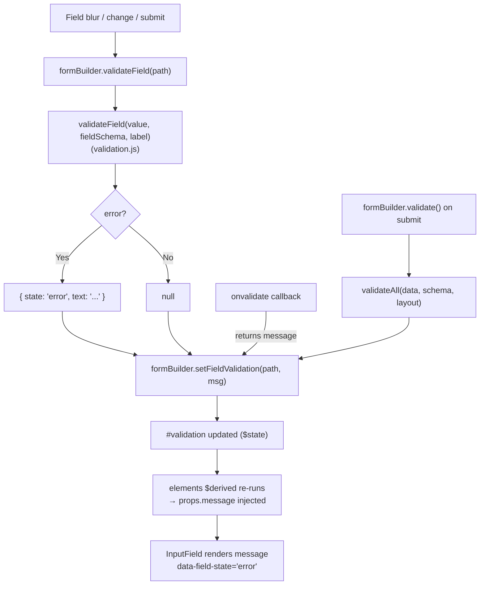
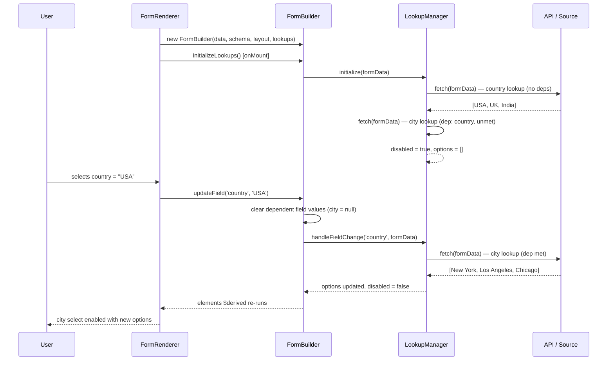

# Forms System

> Design for the schema-driven form system in `@rokkit/forms`.

---

## Design Philosophy

Forms are the most repetitive surface in application development. A developer hand-codes labels, bindings, validation rules, and loading states — then repeats that work for every new form. The Rokkit forms system eliminates that repetition by treating the data schema as the single source of truth.

Four principles govern every design decision in `@rokkit/forms`:

**A form should emerge from the data schema, not be hand-coded.** If you have a JSON schema describing your data — or even just the data itself — the system derives the form structure from it. You don't write templates for individual fields.

**The form system is built on the same component library.** There is no separate "form input world." `InputSelect` wraps `@rokkit/ui Select`. `InputCheckbox` uses the same icon-based checkbox from `@rokkit/core`. Every input participates in the same theming, accessibility, and keyboard navigation as the rest of the library.

**Validation, lookups, and state are managed, not delegated.** The system runs validation on blur, tracks dirty state per field, manages async option loading, and prevents submission when the form is invalid. The consumer does not wire these things together manually.

**The consumer provides data and schema; the system handles the rest.** The only required inputs are a data object and (optionally) a schema. Layout, type resolution, validation rules, and rendering are handled internally. The consumer can override any layer, but nothing forces them to.

---

## Core Concepts

**FormRenderer** is the public-facing component. It is the only thing a consumer needs to import. It accepts `data`, `schema`, `layout`, `lookups`, and a set of callbacks. Internally it creates and owns a `FormBuilder` instance and drives rendering from the builder's reactive `elements` array.

**FormBuilder** is an internal reactive state manager implemented as a plain JavaScript class using Svelte 5 `$state` runes. It holds the current field values, validation messages, dirty flags, and lookup states. It exposes a `$derived` `elements` array that the renderer iterates. Consumers never interact with `FormBuilder` directly unless they need advanced control (e.g., building a master-detail view).

**Schema** is a JSON-schema-like descriptor for the form's fields. It defines field types, constraints, formats, and metadata. The system auto-derives a schema from the data shape when none is provided.

**Layout** is a separate descriptor for presentation: field ordering, grouping, labels, descriptions, separators, and custom rendering hints. It is independent of schema so that the same schema can power multiple different form layouts. The system auto-derives a flat layout from the data when none is provided.

**Lookup** is a configuration for dynamically loading options into select-type fields. A lookup can use a URL template, an async fetch hook, or a client-side filter over a pre-loaded array. Lookups declare their field dependencies so they re-fetch when upstream values change.

---

## Form Rendering Pipeline

The full pipeline from consumer input to rendered HTML:



On every field change:



---

## FormBuilder Responsibilities

`FormBuilder` (`lib/builder.svelte.js`) is the reactive core. It manages all mutable form state using Svelte 5 runes. `FormRenderer` creates one stable instance at mount and wires prop changes to it via `$effect`.

```
FormBuilder (reactive state)
│
├── #data ($state)             — current field values, immutable updates
├── #initialData               — deep clone taken at construction
├── #schema ($state)           — JSON schema (auto-derived if null)
├── #layout ($state)           — layout descriptor (auto-derived if null)
├── #validation ($state)       — Record<fieldPath, { state, text }|null>
├── #lookupConfigs ($state)    — Record<fieldPath, LookupConfig>
├── #lookupManager ($state)    — createLookupManager() instance
│
├── elements ($derived)        — FormElement[] from #buildElements()
│
├── Field access
│   ├── getValue(path)         — reads nested value by slash-separated path
│   └── updateField(path, v)  — immutable update + lookup cascade
│
├── Validation
│   ├── validateField(path)    — validates one field, stores message
│   ├── validate()             — validates all fields (validateAll)
│   ├── setFieldValidation()   — store an external validation message
│   ├── clearValidation()      — wipe all messages
│   ├── isValid (get)          — no error-state messages remain
│   ├── errors (get)           — array of { path, state, text } errors
│   └── messages (get)         — all messages ordered by severity
│
├── Dirty tracking
│   ├── isDirty (get)          — any field differs from initialData
│   ├── dirtyFields (get)      — Set<string> of changed paths
│   ├── isFieldDirty(path)     — single-field dirty check
│   ├── reset()                — restore initialData, clear validation
│   └── snapshot()             — advance initialData to current (post-save)
│
└── Lookups
    ├── initializeLookups()    — called on mount, calls fetch() for all lookups
    ├── getLookupState(path)   — { options, loading, error, fields, disabled }
    ├── isFieldDisabled(path)  — true when dependencies unmet
    └── refreshLookup(path)    — manual re-fetch with current form data
```

`FormRenderer` maintains a single `FormBuilder` instance using `untrack()` at construction and then synchronizes prop changes via `$effect`:

```javascript
let formBuilder = untrack(() => builder ?? new FormBuilder(data, schema, layout, lookups))

$effect(() => {
  if (formBuilder.data !== data) formBuilder.data = data
})
$effect(() => {
  if (schema) formBuilder.schema = schema
})
$effect(() => {
  if (layout) formBuilder.layout = layout
})
```

This pattern is critical: recreating `FormBuilder` on every derivation (e.g., `$derived(new FormBuilder(...))`) would lose validation state, dirty tracking, and the lookup manager on every prop update.

---

## Schema Design

The schema follows a JSON-schema-compatible structure. All standard JSON schema field types and constraints are supported. Additional annotations extend the schema for Rokkit-specific behavior.

### Standard field descriptors

```javascript
{
  type: 'object',
  properties: {
    // Required string with length constraint
    name: {
      type: 'string',
      required: true,
      minLength: 2,
      maxLength: 100,
      title: 'Full Name'
    },

    // Email format — renders as InputEmail
    email: {
      type: 'string',
      format: 'email',
      required: true
    },

    // Enum — renders as InputSelect
    plan: {
      type: 'string',
      enum: ['free', 'pro', 'enterprise'],
      title: 'Subscription Plan'
    },

    // Number with range — renders as InputRange (both min and max present)
    rating: {
      type: 'integer',
      min: 1,
      max: 5,
      title: 'Rating'
    },

    // Boolean — renders as InputCheckbox
    newsletter: {
      type: 'boolean',
      title: 'Subscribe to newsletter'
    },

    // Multiline string — renderer hint in layout, not schema
    bio: {
      type: 'string',
      maxLength: 500
    },

    // Nested object — renders as a labeled fieldset group
    address: {
      type: 'object',
      properties: {
        street: { type: 'string', required: true },
        city:   { type: 'string', required: true },
        state:  { type: 'string' },
        zip:    { type: 'string', pattern: '^\\d{5}(-\\d{4})?$' }
      }
    },

    // Array of primitives — renders as ArrayEditor (primitive mode)
    tags: {
      type: 'array',
      items: { type: 'string' }
    },

    // Dependent select — city depends on country via lookup
    country: { type: 'string', title: 'Country' },
    city:    { type: 'string', title: 'City' },

    // Read-only display field
    createdAt: {
      type: 'string',
      format: 'datetime',
      readonly: true,
      title: 'Created'
    }
  }
}
```

### Renderer and format annotations

The `format` field controls which input component is selected for string fields:

| `format` value | Selected component |
| -------------- | ------------------ |
| `email`        | InputEmail         |
| `url`          | InputUrl           |
| `tel`          | InputTel           |
| `date`         | InputDate          |
| `datetime`     | InputDateTime      |
| `time`         | InputTime          |
| `month`        | InputMonth         |
| `week`         | InputWeek          |
| `color`        | InputColor         |
| `password`     | InputPassword      |

The `renderer` field (set in the layout element) bypasses all type inference and directly names a key in the renderer registry.

### Type resolution priority in `#convertToFormElement`

1. `props.renderer` is set → look up that key in the renderer registry
2. `props.format` is set (and not `'text'` or `'number'`) → use format as type key
3. Schema `type` → apply type-to-component rules:
   - `'number'` or `'integer'` with both `min` and `max` → `'range'`; otherwise → `'number'`
   - `'boolean'` → `'checkbox'`
   - `'string'` with `enum` or `options` → `'select'` (enum values mapped to options array)
   - `'string'` otherwise → `'text'`
   - `'array'` → `'array'` (ArrayEditor)
4. Fallback → `'text'`

`readonly: true` fields bypass this entire chain and render as type `'info'` (InfoField).

### Auto-derivation

When no schema is supplied, `deriveSchemaFromValue(data)` walks the data object and infers types using `@rokkit/data`'s `typeOf`. The result is a valid schema with no constraints — all fields become editable with their JS type as the schema type. Similarly, `deriveLayoutFromValue(data)` generates a flat layout listing every top-level key in data order.

---

## Layout Design

Layout describes _how_ a form is presented, independent of what the schema says about the data. Separating schema from layout makes it possible to present the same data model in multiple ways — a wizard step, a compact sidebar panel, a full-page editor — without duplicating the schema.

A layout is an object with a `type` and an `elements` array:

```javascript
{
  type: 'vertical',
  elements: [
    // Section label (non-scoped, becomes separator)
    { type: 'separator' },

    // A field element — scope is a JSON Pointer to the data property
    { scope: '#/name', label: 'Full Name', placeholder: 'Jane Smith' },

    // Reorder a field that appears later in the schema
    { scope: '#/email', label: 'Email Address' },

    // Textarea hint via renderer override (not in schema)
    { scope: '#/bio', label: 'About You', renderer: 'textarea' },

    // Nested group
    {
      scope: '#/address',
      title: 'Mailing Address',
      elements: [
        { scope: '#/address/street', label: 'Street' },
        { scope: '#/address/city',   label: 'City' },
        { scope: '#/address/state',  label: 'State' },
        { scope: '#/address/zip',    label: 'ZIP Code' }
      ]
    },

    // Custom snippet override — field rendered by consumer-provided snippet
    { scope: '#/plan', label: 'Plan', override: true },

    // Display-only element (non-editable, read from data)
    { type: 'display-section', scope: '#/address', title: 'Delivery Address' }
  ]
}
```

Key layout behaviors:

- **Ordering** — fields appear in the order declared in `elements`, not the schema's property order.
- **Grouping** — a layout element with an `elements` sub-array becomes a `<fieldset>` group. The scope of the parent element points to a nested object in the data.
- **Separators** — elements without a `scope` (or with `type: 'separator'`) become visual dividers.
- **Override** — `override: true` on a layout element causes `FormRenderer` to use the consumer's `child` snippet for that field instead of the default renderer. The element is passed to the snippet so the consumer can read its metadata.
- **Display elements** — `type: 'display-*'` elements render read-only views of data (table, card grid, key-value section, list) rather than input controls.
- **Optional** — when no layout is provided, `deriveLayoutFromValue` generates a flat element for every key in the data, in object property order.

---

## Field Type System

The `defaultRenderers` registry maps type strings to Svelte components. `resolveRenderer` performs a three-step lookup: explicit `renderer` name → type key → fallback to `InputText`.

| Schema type           | Format / annotation       | Rendered component | Notes                         |
| --------------------- | ------------------------- | ------------------ | ----------------------------- |
| `string`              | —                         | `InputText`        | Default text input            |
| `string`              | `format: 'email'`         | `InputEmail`       | `type="email"`                |
| `string`              | `format: 'url'`           | `InputUrl`         | `type="url"`                  |
| `string`              | `format: 'tel'`           | `InputTel`         | `type="tel"`                  |
| `string`              | `format: 'password'`      | `InputPassword`    | `type="password"`             |
| `string`              | `format: 'color'`         | `InputColor`       | `type="color"`                |
| `string`              | `format: 'date'`          | `InputDate`        | `type="date"`                 |
| `string`              | `format: 'datetime'`      | `InputDateTime`    | `type="datetime-local"`       |
| `string`              | `format: 'time'`          | `InputTime`        | `type="time"`                 |
| `string`              | `format: 'month'`         | `InputMonth`       | `type="month"`                |
| `string`              | `format: 'week'`          | `InputWeek`        | `type="week"`                 |
| `string`              | `renderer: 'textarea'`    | `InputTextArea`    | Set in layout, not schema     |
| `string`              | `renderer: 'radio'`       | `InputRadio`       | Set in layout, not schema     |
| `string` with `enum`  | —                         | `InputSelect`      | Enum values mapped to options |
| `number` / `integer`  | —                         | `InputNumber`      | `step="1"` for integer        |
| `number` with min+max | —                         | `InputRange`       | Both min and max required     |
| `boolean`             | —                         | `InputCheckbox`    | Icon-based custom checkbox    |
| `boolean`             | `renderer: 'switch'`      | `InputSwitch`      | Toggle switch                 |
| `boolean`             | `renderer: 'toggle'`      | `InputToggle`      | Option-set toggle             |
| `array`               | —                         | `ArrayEditor`      | Primitive or object items     |
| `object`              | —                         | `<fieldset>` group | Recursive via `renderElement` |
| any                   | `readonly: true`          | `InfoField`        | Read-only display, no input   |
| any                   | `type: 'display-table'`   | `DisplayTable`     | Non-editable data table       |
| any                   | `type: 'display-cards'`   | `DisplayCardGrid`  | Non-editable card grid        |
| any                   | `type: 'display-section'` | `DisplaySection`   | Key-value display             |
| any                   | `type: 'display-list'`    | `DisplayList`      | Simple display list           |

Custom renderers registered via the `renderers` prop extend this table. The consumer passes `renderers={{ myPicker: MyDatePicker }}` to `FormRenderer` and sets `renderer: 'myPicker'` on the relevant layout element. The merged registry replaces the built-in entry when the keys overlap, allowing global type overrides (e.g., replacing all `date` fields with a custom picker).

---

## Validation Design

### Rules and sources

Validation rules come from the schema. The `validateField` function in `validation.js` processes each rule in this order:

1. **Required** — if `fieldSchema.required` and value is empty (`null`, `undefined`, or `''`), return an error.
2. **Type-specific rules** (only when the value is not empty):
   - `string`: `pattern` (regex), `minLength`, `maxLength`, `enum` membership
   - `number`/`integer`: numeric validity, integer check, `min`/`minimum`, `max`/`maximum`
   - `boolean`: `mustBeTrue` (for required acceptance checkboxes)

The `onvalidate` callback on `FormRenderer` provides an escape hatch for custom rules that cannot be expressed in schema. It receives `(fieldPath, value, trigger)` where trigger is `'change'`, `'blur'`, or `'submit'`. If it returns a `{ state, text }` message object, that message is stored in `FormBuilder` via `setFieldValidation`.

### When validation runs

Validation timing is controlled by the `validateOn` prop:

- `'blur'` (default) — `formBuilder.validateField(path)` runs when focus leaves a field.
- `'change'` — validation runs on every field change.
- `'manual'` — validation runs only on submit or when the consumer explicitly calls `formBuilder.validateField`.

On submit, `formBuilder.validate()` runs `validateAll` across every field regardless of `validateOn` mode. If `formBuilder.isValid` is false, submission is blocked and the DOM focus moves to the first error field.

### State representation

Validation messages are stored in `#validation` as a `Record<fieldPath, { state, text }>`. The `state` field is one of `'error'`, `'warning'`, `'info'`, `'success'`. Only `'error'`-state messages block submission (`isValid` checks that no message has `state === 'error'`).

`FormBuilder.#buildElements()` injects each field's validation message into the `FormElement.props.message` object. `InputField` renders the message below the input via `data-message` and reflects the state on the root element via `data-field-state`.

### Data flow diagram



---

## Dynamic Lookup Design

Lookups power select-type fields whose options come from remote or computed sources. The system manages fetch lifecycle, caching, dependency tracking, and disabled state so the consumer does not have to.

### Three lookup modes

**URL template** — the simplest mode. A URL string with `{placeholder}` tokens is interpolated with the current form data. The response is fetched, optionally transformed, and cached by resolved URL with a configurable TTL (default: 5 minutes).

```javascript
lookups: {
  city: {
    url: '/api/cities?country={country}',
    dependsOn: ['country'],
    fields: { label: 'name', value: 'id' },
    cacheTime: 300_000
  }
}
```

**Fetch hook** — replaces URL interpolation with a custom async function. Supports a custom `cacheKey` function; when absent, no caching is performed.

```javascript
lookups: {
  city: {
    dependsOn: ['country'],
    fetch: async (formData) => api.getCities(formData.country),
    fields: { label: 'name', value: 'id' },
    cacheKey: (formData) => `cities-${formData.country}`
  }
}
```

**Source + filter** — client-side filtering of a pre-loaded array. No network request is made. The filter function receives the full source array and the current form data.

```javascript
lookups: {
  city: {
    dependsOn: ['country', 'state'],
    source: allCitiesArray,
    filter: (cities, formData) =>
      cities.filter(c =>
        c.country === formData.country && c.state === formData.state
      ),
    fields: { label: 'name', value: 'id' }
  }
}
```

### Initialization and cascading



### Disabled state and loading

`#convertToFormElement` in `FormBuilder` calls `getLookupState(fieldPath)` for every element and injects lookup-derived props:

- `options` — from `lookupState.options` (overwrites schema enum)
- `loading: true` — when the fetch is in flight
- `disabled: true` — when `lookupState.disabled` (dependencies not met)
- `fields` — field mapping for `@rokkit/ui Select` (maps `text` and `value` keys)

`InputField` reflects `disabled` via `data-field-disabled` and `data-field-state`. The theme applies appropriate visual treatment via these attributes.

---

## Custom Field Rendering

Any field can be rendered by a custom component. There are two scopes of override.

### Per-field override via layout annotation

Set `renderer: 'myKey'` in the layout element and pass `renderers={{ myKey: MyComponent }}` to `FormRenderer`. The custom component receives the same props as any built-in input: `value` (bindable), `onchange`, and the full `props` spread from the `FormElement`.

```javascript
// layout
{ scope: '#/dueDate', label: 'Due Date', renderer: 'fancyDate' }

// component usage
<FormRenderer bind:data {schema} {layout}
  renderers={{ fancyDate: FancyDatePicker }} />
```

### Global type override via renderer registry

Passing a renderer key that matches an existing type name replaces the built-in for that type everywhere in the form:

```javascript
<FormRenderer bind:data {schema} {layout}
  renderers={{ date: MyDatePicker, select: MySelectDropdown }} />
```

### Snippet-based override for full control

Setting `override: true` on a layout element delegates that field's entire rendering to the consumer's `child` snippet. The full `FormElement` is passed so the consumer can read scope, current value, props, and validation message:

```svelte
<FormRenderer bind:data {schema} {layout}>
  {#snippet child(element)}
    {#if element.scope === '#/plan'}
      <PlanSelector
        value={element.value}
        onchange={(v) => element.props.onchange?.(v)}
        message={element.props.message}
      />
    {/if}
  {/snippet}
</FormRenderer>
```

### Custom component contract

A custom renderer component must accept:

- `value` (bindable) — the current field value
- `onchange` — callback to call with the new value when it changes
- Any additional props from `element.props` (label, required, disabled, message, etc.)

Calling `onchange(newValue)` routes through `FormRenderer.handleFieldChange`, which updates `FormBuilder`, triggers lookup cascades, and runs validation. The custom component participates in form state — dirty tracking, validation, and submission — automatically.

---

## Conditional Fields

Conditional fields are planned and not yet implemented. This section describes the intended design.

Fields will be shown or hidden based on the values of other fields. The condition is expressed in the schema using a `showWhen` annotation:

```javascript
// Schema
{
  type: 'object',
  properties: {
    accountType: { type: 'string', enum: ['personal', 'business'] },
    companyName: {
      type: 'string',
      showWhen: { field: 'accountType', equals: 'business' }
    },
    vatNumber: {
      type: 'string',
      showWhen: { field: 'accountType', equals: 'business' }
    }
  }
}
```

`FormBuilder.#buildElements()` will evaluate conditions reactively against the current `#data`. Elements whose conditions are not met will be excluded from the returned `elements` array entirely — they are not rendered at all.

On submission, excluded field values will not appear in the data object passed to `onsubmit`. When a previously hidden field becomes visible (condition met), it initializes to the schema's `default` value or `null`.

The `$derived` nature of `elements` means conditions re-evaluate automatically whenever any field value changes — no imperative toggle code is needed.

---

## Nested Structures

Nesting is handled at two levels: objects (rendered as fieldset groups) and arrays (rendered via `ArrayEditor`).

### Object fields

A schema property with `type: 'object'` and a `properties` map produces a `group`-type `FormElement`. In `FormRenderer`, `group` elements are rendered as a `<fieldset>` with a `<legend>` for the label, and their `props.elements` array is rendered recursively via `renderElement`:

```svelte
{:else if element.type === 'group'}
  <fieldset data-form-group data-scope={element.scope}>
    {#if element.props?.label}
      <legend data-form-group-label>{element.props.label}</legend>
    {/if}
    {#each element.props?.elements ?? [] as child_element, i (child_element.scope ?? i)}
      {@render renderElement(child_element)}
    {/each}
  </fieldset>
```

Nesting is unbounded — the same `renderElement` snippet handles any depth.

### Array fields

`ArrayEditor.svelte` handles arrays. It receives the `items` schema to know what each item looks like, and the current `value` array.

For **arrays of primitives** (`items.type !== 'object'`), each item renders as a single input using the resolved primitive component (`resolveRenderer({ type: itemSchema.type }, defaultRenderers)`).

For **arrays of objects** (`items.type === 'object'`), each item renders as a nested `FormRenderer` instance:

```svelte
{#if itemSchema.type === 'object'}
  <FormRenderer
    data={item}
    schema={itemSchema}
    onupdate={(newData) => updateItem(index, newData)}
  />
{:else}
  <PrimitiveComponent value={item} onchange={(newVal) => updateItem(index, newVal)} />
{/if}
```

This means each array item gets its own complete form pipeline — schema derivation, layout, validation, and (if needed) lookups — without any special-casing in the outer form.

Add and remove buttons are rendered alongside each item. The `addItem` function creates a default value using `createDefaultItem(itemSchema)`, which initializes object properties from their `default` annotations or the type's zero value.

### Structural overview

```
FormElement (group)
└── props.elements: FormElement[]
    ├── FormElement (text)    → InputField → InputText
    ├── FormElement (email)   → InputField → InputEmail
    └── FormElement (group)   → <fieldset> (recursive)
        └── props.elements: FormElement[]
            └── FormElement (text) → InputField → InputText

FormElement (array)
└── ArrayEditor
    ├── item[0] → InputText (primitive)
    ├── item[1] → InputText (primitive)
    └── [Add] button

FormElement (array of objects)
└── ArrayEditor
    ├── item[0] → FormRenderer (full nested form)
    ├── item[1] → FormRenderer (full nested form)
    └── [Add] button → createDefaultItem()
```

---

## Appendix: Data Attributes Reference

### FormRenderer

| Attribute               | Element             | Purpose                           |
| ----------------------- | ------------------- | --------------------------------- |
| `data-form-root`        | `<form>` or `<div>` | Form container                    |
| `data-form-submitting`  | root                | Present during async submission   |
| `data-form-separator`   | `<div>`             | Visual separator between fields   |
| `data-form-field`       | `<div>`             | Wrapper for each rendered element |
| `data-form-group`       | `<fieldset>`        | Nested object section             |
| `data-form-group-label` | `<legend>`          | Group label                       |
| `data-form-actions`     | `<div>`             | Default action buttons container  |
| `data-form-reset`       | `<button>`          | Default reset button              |
| `data-form-submit`      | `<button>`          | Default submit button             |
| `data-scope`            | field/group wrapper | JSON Pointer path to data field   |

### InputField

| Attribute             | Element         | Purpose                                      |
| --------------------- | --------------- | -------------------------------------------- |
| `data-field-root`     | outer `<div>`   | Field container                              |
| `data-field`          | inner `<div>`   | Label + input row                            |
| `data-field-state`    | outer `<div>`   | Validation state: error/warning/info/success |
| `data-field-type`     | outer `<div>`   | Input type string                            |
| `data-field-required` | outer `<div>`   | Present when required                        |
| `data-field-disabled` | outer `<div>`   | Present when disabled                        |
| `data-field-dirty`    | outer `<div>`   | Present when value differs from initial      |
| `data-field-empty`    | outer `<div>`   | Present when value is null/undefined         |
| `data-has-icon`       | outer `<div>`   | Present when field has an icon               |
| `data-description`    | `<div>`         | Help text below the input                    |
| `data-message`        | `<div>`         | Validation message text                      |
| `data-message-state`  | message `<div>` | Mirrors field-state for message styling      |

### Input container

| Attribute         | Element  | Purpose                                                   |
| ----------------- | -------- | --------------------------------------------------------- |
| `data-input-root` | `<div>`  | Wrapper for non-checkbox inputs; used for gradient border |
| `data-input-icon` | `<span>` | Icon rendered inside the input wrapper                    |

### ArrayEditor

| Attribute                        | Element      | Purpose                     |
| -------------------------------- | ------------ | --------------------------- |
| `data-array-editor`              | root `<div>` | Array editor container      |
| `data-array-editor-empty`        | root         | Present when array is empty |
| `data-array-editor-disabled`     | root         | Present when disabled       |
| `data-array-editor-items`        | `<div>`      | Items container             |
| `data-array-editor-item`         | `<div>`      | Individual item row         |
| `data-array-editor-item-content` | `<div>`      | Item input area             |
| `data-array-editor-remove`       | `<button>`   | Remove item button          |
| `data-array-editor-add`          | `<button>`   | Add item button             |

### Display components

| Attribute              | Element | Purpose                       |
| ---------------------- | ------- | ----------------------------- |
| `data-display-table`   | root    | Table display container       |
| `data-display-cards`   | root    | Card grid container           |
| `data-display-card`    | card    | Individual card               |
| `data-display-section` | root    | Key-value section             |
| `data-display-field`   | row     | Individual field row          |
| `data-display-value`   | span    | Formatted value               |
| `data-format`          | value   | Format hint for value styling |

---

## Appendix: Component File Map

```
packages/forms/src/
├── FormRenderer.svelte          — public component; owns FormBuilder lifecycle
├── InputField.svelte            — label + input + message wrapper
├── Input.svelte                 — type dispatcher; delegates to InputXxx via resolveRenderer
├── InfoField.svelte             — read-only field display
├── ValidationReport.svelte      — grouped validation message list
│
├── input/
│   ├── InputText.svelte         — type="text"
│   ├── InputNumber.svelte       — type="number"
│   ├── InputEmail.svelte        — type="email"
│   ├── InputPassword.svelte     — type="password"
│   ├── InputTel.svelte          — type="tel"
│   ├── InputUrl.svelte          — type="url"
│   ├── InputColor.svelte        — type="color"
│   ├── InputDate.svelte         — type="date"
│   ├── InputDateTime.svelte     — type="datetime-local"
│   ├── InputTime.svelte         — type="time"
│   ├── InputMonth.svelte        — type="month"
│   ├── InputWeek.svelte         — type="week"
│   ├── InputRange.svelte        — type="range"
│   ├── InputTextArea.svelte     — <textarea>
│   ├── InputFile.svelte         — type="file"
│   ├── InputCheckbox.svelte     — icon-based checkbox from @rokkit/core
│   ├── InputRadio.svelte        — radio group
│   ├── InputSelect.svelte       — wraps @rokkit/ui Select
│   ├── InputSwitch.svelte       — boolean toggle switch
│   ├── InputToggle.svelte       — option-set toggle
│   └── ArrayEditor.svelte       — add/remove array of primitives or objects
│
├── display/
│   ├── DisplayTable.svelte      — wraps @rokkit/ui Table
│   ├── DisplayCardGrid.svelte   — card grid layout
│   ├── DisplaySection.svelte    — key-value pair display
│   ├── DisplayList.svelte       — simple list display
│   └── DisplayValue.svelte      — formatted value rendering
│
└── lib/
    ├── builder.svelte.js        — FormBuilder class (reactive state)
    ├── lookup.svelte.js         — createLookup, createLookupManager
    ├── validation.js            — validateField, validateAll
    ├── schema.js                — deriveSchemaFromValue
    ├── layout.js                — deriveLayoutFromValue
    ├── fields.js                — getSchemaWithLayout, findAttributeByPath
    └── renderers.js             — defaultRenderers registry, resolveRenderer
```

---

## Implementation Notes

### FormBuilder Stability

`FormRenderer` must maintain a single stable `FormBuilder` instance across prop changes. Recreating it on each derivation loses validation state, dirty tracking, and the lookup manager.

**Incorrect pattern** (loses state on every prop update):

```javascript
let formBuilder = $derived(new FormBuilder(data, schema, layout))
```

**Correct pattern** (stable instance, reactive updates):

```javascript
let formBuilder = untrack(() => builder ?? new FormBuilder(data, schema, layout, lookups))

$effect(() => {
  if (formBuilder.data !== data) formBuilder.data = data
})
$effect(() => {
  if (schema) formBuilder.schema = schema
})
$effect(() => {
  if (layout) formBuilder.layout = layout
})
```

`untrack()` at construction prevents Svelte from treating `FormBuilder` construction as a reactive dependency. The `$effect` blocks synchronize each prop individually after construction, so the instance remains stable while remaining reactive to external changes.

### Custom Type Renderer Registry

`resolveRenderer` performs a three-step lookup against a merged registry of built-in and consumer-provided renderers:

```
element
  │
  ├── props.renderer set?
  │     YES → allRenderers[props.renderer] (explicit override wins)
  │
  ├── element.type set in allRenderers?
  │     YES → allRenderers[element.type]
  │
  └── fallback → InputText
```

The default registry (`defaultRenderers`) maps type strings to components:

```javascript
const defaultRenderers = {
  text: InputText,
  number: InputNumber,
  email: InputEmail,
  password: InputPassword,
  tel: InputTel,
  url: InputUrl,
  color: InputColor,
  date: InputDate,
  time: InputTime,
  month: InputMonth,
  week: InputWeek,
  range: InputRange,
  textarea: InputTextArea,
  checkbox: InputCheckbox,
  radio: InputRadio,
  select: InputSelect,
  switch: InputSwitch,
  toggle: InputToggle,
  array: ArrayEditor,
  info: InfoField
}
```

Consumers pass a `renderers` prop to `FormRenderer` to extend or override this registry:

```javascript
// In FormRenderer
const allRenderers = $derived({ ...defaultRenderers, ...customRenderers })
```

Passing a key that already exists in `defaultRenderers` replaces the built-in for that type everywhere in the form. This makes global type replacement (e.g., all `date` fields using a custom picker) a single line:

```svelte
<FormRenderer bind:data {schema} renderers={{ date: MyDatePicker }} />
```

Per-field overrides use the `renderer` annotation in the layout element, which bypasses the type-to-component mapping entirely and looks up the key directly in `allRenderers`.
