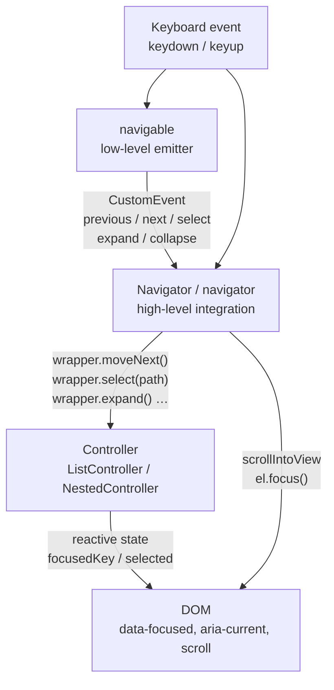
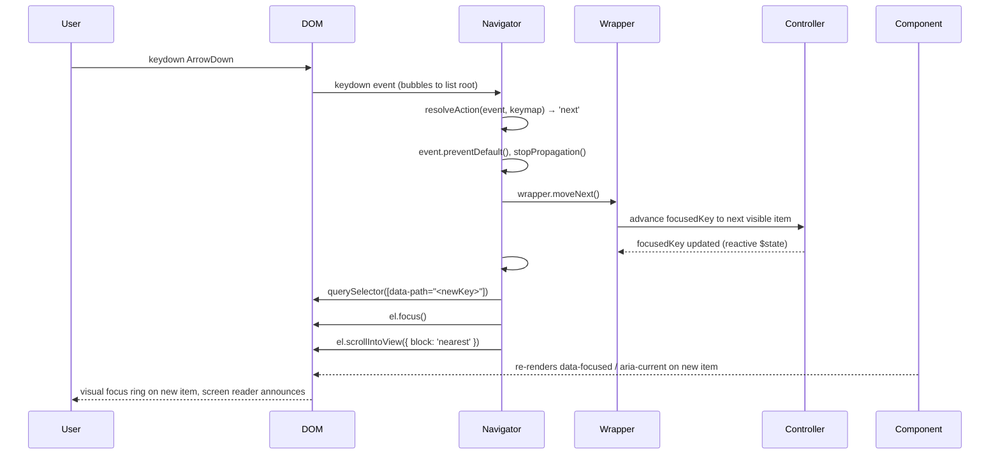

# Design: @rokkit/actions

> Interaction behaviors and keyboard navigation for Svelte 5 components

## 1. Design Philosophy

The `@rokkit/actions` package provides Svelte actions — functions applied to DOM elements via the `use:` directive — that add interaction behaviors without coupling to any particular component. Several principles govern their design.

**Actions separate behavior from rendering.** A component is responsible for what the DOM looks like. An action is responsible for how it behaves. The `navigator` action attaches keyboard and click handling to a container and calls methods on a controller, but it never reads or writes Svelte state directly. The component decides what to render in response to controller state changes.

**The same action works on any element.** There is no base class to extend, no special component to wrap. Applying `use:navigator` to a `<div>`, a `<ul>`, or a `<nav>` element produces identical behavior. This makes the primitives genuinely reusable for custom component authors.

**Actions are composable.** Each action registers its own event listeners and cleans them up independently. Multiple actions on a single element coexist without coordination. A button can carry `use:ripple` and `use:hoverLift` simultaneously; neither action knows the other exists.

**Navigation is data-driven.** Orientation, text direction, and nesting behavior are not hardcoded. They come from options passed at the call site. The same keymap logic that drives a vertical list can drive a horizontal tab bar or an RTL tree by changing two option values.

---

## 2. Action Inventory

The package exports the following actions. All are Svelte 5 `$effect`-based unless noted as a plain class.

| Action | Purpose | Exported as |
|--------|---------|-------------|
| `navigator` | Keyboard navigation + selection for any container (function form, legacy) | `navigator` |
| `Navigator` | Keyboard navigation + selection — preferred class form | `Navigator` (class) |
| `Trigger` | Dropdown open/close management for trigger buttons | `Trigger` (class) |
| `navigable` | Low-level semantic event emitter, foundational primitive | `navigable` |
| `dismissable` | Escape key + click-outside dismissal | `dismissable` |
| `keyboard` | Custom key-to-event mapping for non-navigation keyboards | `keyboard` |
| `themable` | Applies theme data attributes to a root element | `themable` |
| `skinnable` | Variant of themable for component-level skin overrides | `skinnable` |
| `fillable` | Fill-in-the-blank interaction for learning exercises | `fillable` |
| `pannable` | Mouse and touch panning for scrollable containers | `pannable` |
| `swipeable` | Touch swipe gesture detection | `swipeable` |
| `reveal` | Scroll-triggered viewport entry animation | `reveal` |
| `ripple` | Material-style click ripple animation | `ripple` |
| `hoverLift` | Hover elevation with shadow and translateY | `hoverLift` |
| `magnetic` | Cursor-attracted positional offset on hover | `magnetic` |
| `delegateKeyboardEvents` | Forwards keyboard events across a shadow boundary | `delegateKeyboardEvents` |

The navigation-related entries — `Navigator`, `Trigger`, `navigable`, `dismissable`, and `keyboard` — form the core of the package and receive the most detailed treatment below.

---

## 3. Navigation Architecture

### The Two-Layer Model

Navigation is split into two abstraction layers. The lower layer maps raw keyboard events to semantic intent. The upper layer acts on that intent by mutating controller state and keeping the DOM in sync.



**`navigable`** is the foundational layer. It listens to `keyup` on a single element and converts key presses into named `CustomEvent`s: `previous`, `next`, `select`, `expand`, `collapse`. It has no knowledge of state, controllers, or the DOM structure beyond its host element. Orientation, direction, and nesting are passed as options; they determine which physical keys fire which semantic events. It is useful when a component only needs to react to navigation signals without a full controller integration.

**`Navigator`** (class) and **`navigator`** (function action, legacy) are the high-level layer. They attach to a container element, listen for `keydown` and `click`, resolve each event to a named action via a pre-built keymap, and call the corresponding method on the controller (`wrapper`). They also handle `focusin` and `focusout` for roving tabindex management, run typeahead search, and scroll the focused element into view after every keyboard move.

The class form (`Navigator`) is preferred in library components because it is a plain object with explicit `destroy()`, making lifecycle management straightforward inside Svelte `$effect` blocks. The function form (`navigator`) wraps the same logic inside a Svelte action for simpler one-liner usage.

### Navigator Options

Both `Navigator` and `navigator` accept the same configuration object.

| Option | Type | Default | Purpose |
|--------|------|---------|---------|
| `wrapper` | Controller | required | The controller to dispatch actions to |
| `orientation` | `'vertical' \| 'horizontal'` | `'vertical'` | Which arrow keys mean previous/next |
| `dir` | `'ltr' \| 'rtl'` | `'ltr'` | Text direction; reverses horizontal arrow meaning |
| `collapsible` | `boolean` | `false` | Whether to bind expand/collapse keys (ArrowLeft/Right or ArrowUp/Down) |

The `navigable` action uses identical options except it does not accept a `wrapper`.

### Key Mapping

The keymap is built once at construction time by `buildKeymap()` in `keymap.js`. It produces three layers — plain, shift, ctrl — each mapping a key name to a semantic action name. `resolveAction(event, keymap)` selects the correct layer based on which modifier keys are held.

#### Plain keys (no modifiers)

| Key | Vertical LTR | Vertical RTL | Horizontal |
|-----|-------------|-------------|------------|
| ArrowUp | `prev` | `prev` | — |
| ArrowDown | `next` | `next` | — |
| ArrowLeft | `collapse`* | `expand`* | `prev` |
| ArrowRight | `expand`* | `collapse`* | `next` |
| Home | `first` | `first` | `first` |
| End | `last` | `last` | `last` |
| Enter | `select` | `select` | `select` |
| Space | `select` | `select` | `select` |
| Escape | `cancel` | `cancel` | `cancel` |

\* Only bound when `collapsible: true`. For horizontal orientation, expand/collapse are instead bound to ArrowDown/ArrowUp.

#### Modifier keys

| Key | Ctrl/Cmd | Shift |
|-----|----------|-------|
| Space | `extend` (toggle individual selection) | `range` (contiguous range selection) |
| Home | `first` | — |
| End | `last` | — |

#### Click action resolution

Clicks are disambiguated by modifier state and target:

| Condition | Action |
|-----------|--------|
| Shift held (no Ctrl) | `range` |
| Ctrl or Meta held | `extend` |
| Target or ancestor has `data-accordion-trigger` | `toggle` |
| Otherwise | `select` |

### Event Flow

The following sequence traces what happens when a user presses ArrowDown inside a `List` component.



Two details are worth noting. First, `#syncFocus()` both focuses the DOM element and scrolls it into view in a single step — no `setTimeout` is needed in the class form. Second, when expand or collapse causes focus to move to a different item (e.g., expanding a group moves focus to its first child), `#syncFocus()` runs after the wrapper call for those actions too.

### The `data-path` Convention

`Navigator` identifies navigable targets by the presence of a `data-path` attribute on DOM elements inside the container. Walking up from the event target to the container root, it finds the nearest element with `data--path` and treats its value as the item's key.

- Elements with `data-path` are navigable: list items, tree nodes, tab buttons, menu items.
- Elements without `data-path` are invisible to the navigator: separators, spacers, group headers that only toggle (though those carry `data-accordion-trigger` instead).
- The `data-path` value is the item's opaque string key as assigned by the controller (typically a stringified index path like `"0"`, `"1"`, or `"0.2.1"` for nested items).

This convention means separators and spacers require no special handling — they simply lack the attribute and are silently skipped.

### Focusin / Focusout and Roving Tabindex

`Navigator` listens to `focusin` and `focusout` at the container level to handle focus entering and leaving the list.

On `focusin`: if the focused element has a `data-path`, `moveTo(path)` is called to sync controller state. If focus landed on the container itself (the user tabbed in and no item element was focused), the Navigator redirects focus to the element matching `focusedKey`, or to the first navigable item if `focusedKey` is unset.

On `focusout`: if the newly focused element (`relatedTarget`) is outside the container, `wrapper.blur?.()` is called. Components can use this hook to close dropdowns or perform cleanup.

---

## 4. Controller Integration

Navigator does not manage selection or focus state itself. It delegates all state mutations to the controller passed as `wrapper`. The controller interface is:

```javascript
// Movement (ignore path argument)
wrapper.moveNext()
wrapper.movePrev()
wrapper.moveFirst()
wrapper.moveLast()
wrapper.moveTo(path)
wrapper.expand()      // expand focused item (collapsible only)
wrapper.collapse()    // collapse focused item (collapsible only)

// Selection (use path argument)
wrapper.select(path)
wrapper.extendSelection(path)   // toggle individual item in multi-select
wrapper.selectRange(path)       // extend selection to path (shift+click/space)
wrapper.toggleExpansion(path)   // toggle expand/collapse at path

// Query
wrapper.focusedKey              // string | null — current focus
wrapper.focused                 // the focused item value
wrapper.selected                // the selected value(s)
wrapper.findByText(text, startAfter)  // typeahead search

// Optional lifecycle hooks
wrapper.blur?.()                // called when focus leaves the container
wrapper.cancel?.()              // called on Escape
```

`ListController` satisfies this interface for flat lists. `NestedController` extends it with expand/collapse semantics for trees and collapsible groups. Custom wrappers can satisfy the same interface to plug into `Navigator` without using the built-in controllers.

The reactive state (`focusedKey`, `selected`, etc.) is `$state`-based inside the controllers. When Navigator calls a mutation method, the controller updates its reactive state, which causes Svelte to re-render the component. The component reads controller state to apply `data-focused`, `aria-current`, `aria-selected`, and `aria-expanded` attributes to the correct elements on the next render.

---

## 5. Trigger and Dropdown Composition

Dropdown components — `Select`, `MultiSelect`, `Menu` — require two coordinated pieces: a trigger button that opens and closes the overlay, and a navigator that handles keyboard interaction inside the open overlay. The `Trigger` class manages the first responsibility.

`Trigger` listens to events on the trigger button element and document-level events for click-outside and Escape:

| Event | Source | Behavior |
|-------|--------|----------|
| `click` trigger | trigger element | Toggle open/close |
| `Enter` / `Space` | trigger element | Toggle open/close |
| `ArrowDown` | trigger element | Open (focus first item) |
| `ArrowUp` | trigger element | Open, then call `onlast` to focus last item |
| `Escape` | document keydown | Close + return focus to trigger |
| `click` outside | document click (capture) | Close + return focus to trigger |

`Navigator` is attached to the dropdown element (not the trigger). When the overlay closes, the `Navigator` is destroyed. When it opens, a new `Navigator` is constructed on the newly rendered dropdown element.

This split keeps each class focused: `Trigger` never reads item state, and `Navigator` never manages open/close.

---

## 6. Dismissable Action

`dismissable` is a simpler, standalone overlay-dismissal action for cases where the `Trigger`/`Navigator` pairing is not appropriate (modal dialogs, popovers, tooltips).

Applied to a host element, it:

1. Listens for `keyup` on `document`. If the key is Escape, it calls `event.stopPropagation()` and dispatches a `dismiss` CustomEvent on the host element.
2. Listens for `click` on `document`. If the clicked element is outside the host (not contained by it) and the event has not been prevented, it dispatches `dismiss` on the host.

The component handles `dismiss` to close the overlay. The action itself makes no assumptions about what "closing" means.

Both listeners are document-level and are cleaned up when the action's `$effect` runs its return function — which happens when the component unmounts or when Svelte re-runs the effect after option changes.

---

## 7. Interaction Actions

### Ripple

The `ripple` action adds a Material Design-style expanding circle at the point of a click.

On each click event:
1. Compute the click position relative to the element's bounding rect.
2. Create a `<span>` absolutely positioned so its center is at the click point. Its diameter is `2 × max(width, height)` so it always covers the full element when fully expanded.
3. Apply a CSS `@keyframes` animation (`rokkit-ripple`) injected once into `document.head` that scales the span from 0 to 1 and fades its opacity to 0.
4. Remove the span when `animationend` fires, with a fallback `setTimeout` for environments where `animationend` may not fire (JSDOM in tests).

The host element's `overflow` is forced to `hidden` while the action is active so the ripple is clipped to the element boundary. Its `position` is forced to `relative` (or left unchanged if already positioned) so the absolute span is contained correctly. Both values are restored on cleanup.

On keyboard activation (Enter/Space), the browser fires a synthetic click at the center of the element, so the ripple naturally originates from the center without special-casing.

The action reads `prefers-reduced-motion` on mount. If the user has requested reduced motion, the action returns immediately without attaching any listeners or styles.

**Options:**

| Option | Default | Description |
|--------|---------|-------------|
| `color` | `'currentColor'` | Ripple fill color |
| `opacity` | `0.15` | Initial ripple opacity |
| `duration` | `500` | Animation duration in milliseconds |

### Hover Lift

The `hoverLift` action gives an element a subtle elevation cue on hover — a slight upward translateY and increased box shadow.

On `mouseenter`: sets `transform: translateY(distance)` and `box-shadow` to the configured shadow string.
On `mouseleave`: restores the original values.

The transition is applied to the element's `transition` style on mount so that the lift and its reversal are smoothly animated. Original `transform`, `box-shadow`, and `transition` values are captured at mount time and fully restored on cleanup, so the action is non-destructive and safe to toggle on and off.

Layout is not affected because `transform` does not shift surrounding elements.

Respects `prefers-reduced-motion`: the action is a no-op if the media query matches.

**Options:**

| Option | Default | Description |
|--------|---------|-------------|
| `distance` | `'-0.25rem'` | Vertical translate on hover (negative = up) |
| `shadow` | `'0 10px 25px -5px rgba(0,0,0,0.1)'` | Box shadow on hover |
| `duration` | `200` | Transition duration in milliseconds |

### Magnetic

The `magnetic` action creates a tactile pull effect: as the cursor moves within the element's bounding box, the element shifts position toward the cursor.

On `mousemove`: compute the cursor's offset from the element's center. Multiply by `strength` (a fraction between 0 and 1) to get the displacement in pixels. Apply as `transform: translate(offsetX, offsetY)`. The transition is set to `none` during movement so the element tracks the cursor without lag.

On `mouseleave`: re-enable the transition and reset `transform` to the original value, so the element returns smoothly to its resting position.

Like the other interaction actions, `magnetic` uses `transform` only, so surrounding layout is unaffected.

Respects `prefers-reduced-motion`.

**Options:**

| Option | Default | Description |
|--------|---------|-------------|
| `strength` | `0.3` | Maximum displacement as a fraction of element size (0–1) |
| `duration` | `300` | Return-to-center transition duration in milliseconds |

### Reveal

The `reveal` action applies a scroll-triggered entry animation using `IntersectionObserver`. When the element enters the viewport beyond the configured threshold, it receives a `data-reveal-visible` attribute which CSS uses to animate it from an offset position to its natural position.

Direction, distance, duration, delay, easing, and threshold are all configurable. The animation can be set to fire once or repeat each time the element enters and leaves the viewport.

Respects `prefers-reduced-motion` by immediately applying `data-reveal-visible` without animation.

### Action Composition

Because each action manages its own event listeners independently, combining multiple actions on one element requires no coordination. Svelte applies them in declaration order; they stack without conflict.

```svelte
<!-- Ripple and lift both work on a single button -->
<button use:ripple use:hoverLift>Click me</button>

<!-- Navigation on container, ripple on items — fully independent -->
<ul use:navigator={{ wrapper, orientation: 'vertical' }}>
  {#each items as item}
    <li data-path={item.key} use:ripple>{item.label}</li>
  {/each}
</ul>
```

The only interaction to be aware of: both `hoverLift` and `magnetic` write to `element.style.transform`. Applying both to the same element would cause them to overwrite each other's value. In practice they serve different use cases and are not typically combined.

---

## 8. Usage in Library Components

The following table shows how `@rokkit/ui` components apply `Navigator` and related classes. All use the class form (not the `use:navigator` directive form) for explicit lifecycle control inside `$effect` blocks.

| Component | Navigator options | Notes |
|-----------|------------------|-------|
| `List` | `{ collapsible, dir }` | `collapsible` comes from whether a `hierarchy` prop is set; vertical orientation by default |
| `Tree` | `{ collapsible: true, dir }` | Always collapsible; uses `NestedController` |
| `LazyTree` | `{ collapsible: true, dir }` | Same as Tree but items load on expand |
| `Tabs` | `{ orientation }` | Horizontal by default; `orientation` prop allows vertical tabs |
| `Toggle` | `{ orientation: 'horizontal', dir }` | Horizontal, no collapsible |
| `Grid` | `{ orientation: 'horizontal', dir }` | Horizontal grid navigation |
| `Select` | `{ dir }` | Navigator on dropdown only; `Trigger` on trigger button |
| `MultiSelect` | `{ dir }` | Same pattern as Select |
| `Menu` | `{ collapsible, dir }` | Navigator on dropdown; `Trigger` on trigger; `collapsible` for grouped menus |
| `Table` | `use:navigator` directive | Uses legacy function form; vertical, no collapsible |
| `Toolbar` | `use:navigator` directive | Uses legacy function form; orientation prop forwarded |

Dropdown components (`Select`, `MultiSelect`, `Menu`) follow a consistent pattern:

```javascript
// Inside $effect:
const t = new Trigger(triggerRef, rootRef, {
  onopen: () => { isOpen = true },
  onclose: () => { isOpen = false }
})

// Separate $effect that runs when isOpen becomes true and dropdown renders:
const nav = new Navigator(dropdownRef, wrapper, { dir })
return () => nav.destroy()
```

The `Navigator` is constructed only when the dropdown is open and a `dropdownRef` is available. Destroying it when the dropdown closes ensures no stale event listeners remain.

---

## 9. Utility Exports

### `keyboard`

A general-purpose custom key mapping action, distinct from navigation. It maps arbitrary keys (or character patterns) to named events that the host element dispatches. Used for specialized inputs like tag editors, where Backspace means "remove last tag" rather than "navigate back".

```javascript
// Default mappings:
{
  remove: ['Backspace', 'Delete'],
  submit: ['Enter'],
  add: /^[a-zA-Z]$/
}
```

### `themable`

Applies `data-style`, `data-mode`, and `data-density` attributes to the host element from a reactive theme store. Optionally persists theme state to `localStorage` and listens for `storage` events to sync across tabs. Used on the application root to make all descendant components inherit the active theme via CSS attribute selectors.

### `buildKeymap` / `resolveAction` / `ACTIONS`

These are exported for consumers who need to build custom navigation logic on top of the same keymap infrastructure the library uses internally. `buildKeymap(options)` returns a three-layer map; `resolveAction(event, keymap)` resolves a keyboard event against it.

---

## 10. Known Gaps and Future Enhancements

These are documented design gaps — areas where the current implementation is intentionally minimal and future work would improve completeness.

**Scroll-to-active on initial value binding.** `Navigator` only scrolls the focused element into view in response to keyboard events and typeahead. When a component mounts with a pre-selected `value` prop, the selected item is not scrolled into view automatically. The fix would be an `$effect` in the component that calls `scrollIntoView` when `value` changes programmatically.

**RTL not exposed uniformly.** The `dir` option is supported by all Navigator instances, and `@rokkit/states` includes a `vibe` store with an auto-detected `direction` field. However, not all UI components currently accept or forward a `dir` prop to their Navigator. Consumers wanting RTL must reach inside the controller options manually.

**Virtualization.** `Navigator` uses `querySelector('[data-path="..."]')` to find DOM elements. Virtual lists only render visible items, so off-screen items have no DOM element. Scroll and focus would fail for items outside the rendered window. Supporting virtualization would require either a callback-based scroll API (where the list component handles scrolling to an index) or a virtual-list-aware wrapper that translates key to scroll offset.

**Enhanced tree navigation.** Home and End in a tree currently jump to the absolute first and last visible items. Standard tree widget patterns (ARIA Authoring Practices Guide) define additional shortcuts: Home/End at a given level navigate to first/last sibling, and Alt+Home/End navigate to first/last across all levels. The `NestedController` methods needed for sibling-level navigation (`moveToFirstSibling`, `moveToLastSibling`) do not yet exist.

**Scroll behavior customization.** `scrollIntoView` is called with a fixed `{ block: 'nearest', inline: 'nearest' }` scroll option. There is no way for a consumer to request `block: 'center'`, disable smooth scrolling, or skip scrolling entirely for specific use cases. Exposing a `scrollBehavior` option on Navigator would address this.

---

## Navigator Testing Patterns

Because `Navigator` is a plain class (not a Svelte component), it can be tested against a real JSDOM without any component mounting overhead.

### MockWrapper

Create a `MockWrapper` that records every call made by Navigator:

```javascript
class MockWrapper {
  focusedKey = null
  calls = []

  next(path)     { this.calls.push({ action: 'next', path }) }
  prev(path)     { this.calls.push({ action: 'prev', path }) }
  first(path)    { this.calls.push({ action: 'first', path }) }
  last(path)     { this.calls.push({ action: 'last', path }) }
  select(path)   { this.calls.push({ action: 'select', path }) }
  expand(path)   { this.calls.push({ action: 'expand', path }) }
  collapse(path) { this.calls.push({ action: 'collapse', path }) }
  moveTo(path)   { this.calls.push({ action: 'moveTo', path }); this.focusedKey = path }
  blur()         { this.calls.push({ action: 'blur', path: null }) }
  cancel(path)   { this.calls.push({ action: 'cancel', path }) }
  findByText()   { return null }

  lastCall() { return this.calls[this.calls.length - 1] }
  reset()    { this.calls = [] }
}
```

Basic test pattern:

```javascript
const wrapper = new MockWrapper()
const nav = new Navigator(container, wrapper, { collapsible: true })

fireEvent.keyDown(container, { key: 'ArrowDown' })
expect(wrapper.lastCall()).toEqual({ action: 'next', path: null })
```

### `wrapper.reset()` Timing

`focusin` fires synchronously when `.focus()` is called on a DOM element. This means calling `element.focus()` in test setup triggers a `moveTo` call before the test body runs. Always call `wrapper.reset()` **after** any `.focus()` setup call:

```javascript
// Setup
button1.focus()
wrapper.reset()  // clear the moveTo call triggered by focus

// Now test
fireEvent.keyDown(container, { key: 'ArrowDown' })
expect(wrapper.lastCall()).toEqual({ action: 'next', path: '0' })
```

Similarly, if you need to override `focusedKey` after focusing an element:

```javascript
button1.focus()
wrapper.focusedKey = null  // override the focusin-set value
wrapper.reset()
```

### Keymap Pure Function Tests

`buildKeymap` and `resolveAction` are pure functions with no DOM dependency. They can be tested without any setup:

```javascript
import { buildKeymap, resolveAction } from '@rokkit/actions'

describe('vertical keymap', () => {
  const km = buildKeymap({ orientation: 'vertical', collapsible: true })

  it('maps ArrowDown to next', () => {
    const e = new KeyboardEvent('keydown', { key: 'ArrowDown' })
    expect(resolveAction(e, km)).toBe('next')
  })

  it('maps ArrowLeft to collapse', () => {
    const e = new KeyboardEvent('keydown', { key: 'ArrowLeft' })
    expect(resolveAction(e, km)).toBe('collapse')
  })
})
```

Use `vi.useFakeTimers()` for typeahead buffer reset tests — the 500ms reset timer uses `setTimeout` internally.
