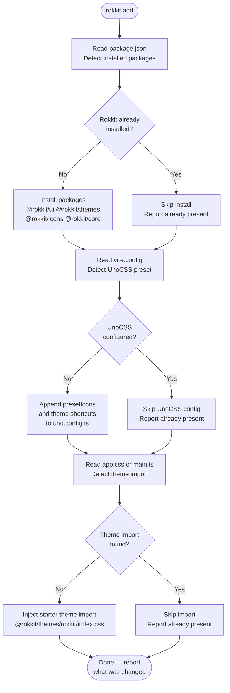
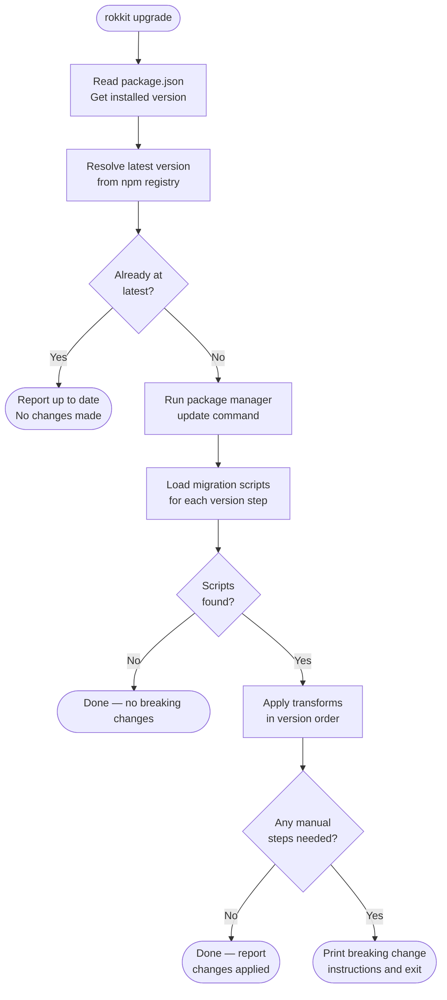
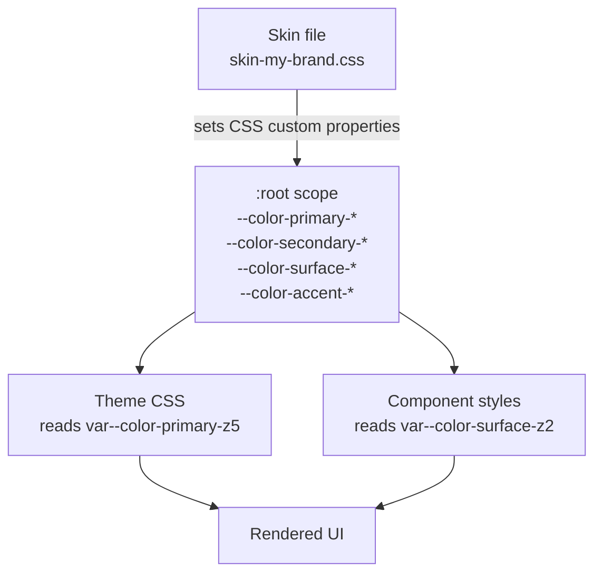

# Toolchain

The design for Rokkit's developer toolchain: the CLI, icon system, skin authoring, and theme style authoring. The toolchain's job is to eliminate the setup and customization ceremony that slows adoption.

---

## CLI Architecture

The CLI is a single binary — `rokkit` — with subcommands for project setup, upgrades, and asset generation. The tool is additive and idempotent: it detects what already exists, adds only what is missing, and never overwrites user-modified files.

### Command surface

```
rokkit add                          — install packages, wire build config, import starter theme
rokkit upgrade                      — update packages, apply migration transforms
rokkit skin create --name <name>    — generate custom skin file with all token slots
rokkit theme create --name <name>   — generate CSS scaffold with data-attribute selectors
```

### Command flow — `rokkit add`



### Command flow — `rokkit upgrade`



### Migration system

Migrations are version-specific transform scripts stored in the CLI package under `migrations/<from>-to-<to>.js`. Each migration script exports:

```js
// migrations/1.2.0-to-1.3.0.js
export const version = '1.3.0'
export const breaking = false

export async function transform(context) {
  // context.readFile(path) — read project files
  // context.writeFile(path, content) — write with change tracking
  // context.report(message) — append to change log
  // context.warn(message) — flag manual action needed
}
```

The upgrade command collects all migration scripts between the installed version and the target version, runs them in ascending order, then prints a consolidated report. If any script sets `breaking = true` or calls `context.warn()`, the summary flags that manual review is needed.

### Configuration detection

The CLI reads three files to understand what already exists:

| File                                      | What the CLI looks for                                        |
| ----------------------------------------- | ------------------------------------------------------------- |
| `package.json`                            | `dependencies` and `devDependencies` for `@rokkit/*` packages |
| `vite.config.ts` / `uno.config.ts`        | `presetIcons`, `presetUno`, `rokkit` theme shortcuts          |
| `app.css` / `src/app.css` / `src/main.ts` | `@rokkit/themes` import statement                             |

Detection is conservative: if the CLI cannot determine whether something is configured, it reports uncertainty rather than overwriting.

### CLI framework

The CLI uses **[citty](https://github.com/unjs/citty)** for command definition and **[@clack/prompts](https://github.com/bombshell-dev/clack)** for interactive UX (spinners, confirmation prompts, summary boxes). Both are lightweight and have no runtime dependencies.

---

## Icon Sets

### Collection format

Rokkit icons follow the **Iconify** collection format — a JSON file with an `icons` map from icon name to SVG path data:

```json
{
  "prefix": "rokkit",
  "icons": {
    "action-add": { "body": "<path d=\"...\" />" },
    "action-close": { "body": "<path d=\"...\" />" },
    "navigate-up": { "body": "<path d=\"...\" />" }
  },
  "width": 24,
  "height": 24
}
```

This makes the collection compatible with UnoCSS `presetIcons` and any other Iconify-compatible toolchain without modification.

### Component vocabulary

Icons are organized into four categories that map to component needs:

| Category   | Icons                                                                                                                                                                                                                        |
| ---------- | ---------------------------------------------------------------------------------------------------------------------------------------------------------------------------------------------------------------------------- |
| Navigation | `navigate-up`, `navigate-down`, `navigate-left`, `navigate-right`, `arrow-up`, `arrow-down`, `arrow-left`, `arrow-right`, `menu-closed`, `menu-opened`, `node-closed`, `node-opened`, `accordion-closed`, `accordion-opened` |
| Status     | `state-success`, `state-warning`, `state-error`, `state-info`, `badge-pass`, `badge-fail`, `badge-warn`, `badge-unknown`, `validity-passed`, `validity-failed`, `validity-warning`                                           |
| Actions    | `action-add`, `action-remove`, `action-close`, `action-clear`, `action-search`, `action-copy`, `action-save`, `action-cancel`, `action-sort-up`, `action-sort-down`, `sort-ascending`, `sort-descending`                     |
| Objects    | `calendar`, `folder-closed`, `folder-opened`, `properties`, `palette`, `selector`, `checkbox-checked`, `checkbox-unchecked`, `radio-on`, `radio-off`                                                                         |

### Tree-shaking via named exports

Icons are exported individually from `@rokkit/icons` so bundlers can eliminate unused ones:

```js
// Only action-add and state-success land in the bundle
import { actionAdd, stateSuccess } from '@rokkit/icons'
```

UnoCSS `presetIcons` performs its own tree-shaking at build time: only icon classes that appear in scanned source files are emitted into the CSS output.

### CSS-only icon rendering

Icons render as CSS mask images on an inline element. No SVG is injected into the DOM and no JavaScript runs at render time:

```css
/* Generated by UnoCSS presetIcons */
.i-rokkit-action-add {
  display: inline-block;
  width: 1em;
  height: 1em;
  background-color: currentColor;
  mask-image: url('data:image/svg+xml,...');
  mask-size: 100% 100%;
  mask-repeat: no-repeat;
}
```

Size is controlled by `font-size` or an explicit `width`/`height`. Color is controlled by `color`. This makes icons fully styleable with ordinary CSS rules and no component API surface.

### Custom icon override — global snippet

Components that render icons use a shared `icon` snippet internally. An application can replace this globally by registering a snippet in the Rokkit context provider:

```svelte
<!-- App.svelte — registered once, applies everywhere -->
<RokkitProvider>
  {#snippet icon(identifier)}
    <LucideIcon name={identifier} />
  {/snippet}
  <slot />
</RokkitProvider>
```

The `identifier` is the value of the `icon` field from the item data — whatever string the data carries. The custom snippet receives it and resolves it using any icon system it chooses. The default Rokkit icon CSS is not loaded if a custom snippet is registered.

---

## Skin System

A skin defines the color personality of the application. It maps semantic color roles to a concrete palette by setting CSS custom properties on `:root`. The rest of the system — themes, components, modes — reads those properties.

### Architecture



### Skin file structure

A skin file is a single CSS file that sets token values on `:root`. Every token slot is present and annotated:

```css
/* skin-my-brand.css — generated by: rokkit skin create --name my-brand */

:root {
  /* ── Primary ─────────────────────────────────────────────
     The main brand color. Used for selected items, active
     states, primary buttons, and key interactive elements. */
  --color-primary-50: #f0fdf4;
  --color-primary-100: #dcfce7;
  --color-primary-200: #bbf7d0;
  --color-primary-300: #86efac;
  --color-primary-400: #4ade80;
  --color-primary-500: #22c55e;
  --color-primary-600: #16a34a;
  --color-primary-700: #15803d;
  --color-primary-800: #166534;
  --color-primary-900: #14532d;
  --color-primary-950: #052e16;

  /* ── Secondary ───────────────────────────────────────────
     Complements primary. Used for hover gradients, accents
     on selected items, and secondary interactive elements. */
  --color-secondary-50: /* ... */;
  /* ... 50 through 950 ... */

  /* ── Surface ─────────────────────────────────────────────
     Backgrounds and structural surfaces. z1 = lightest in
     light mode (darkest in dark mode). z10 = opposite.
     The z-scale inverts automatically with data-mode="dark". */
  --color-surface-50: #fafafa;
  /* ... */
  --color-surface-950: #09090b;

  /* ── Accent ──────────────────────────────────────────────
     Highlight color for badges, tags, and decorative uses. */
  --color-accent-50: /* ... */;
  /* ... */

  /* ── Semantic states ─────────────────────────────────────
     Fixed-meaning colors regardless of brand. Keep these
     perceptually distinct in both light and dark modes.   */
  --color-success-500: #22c55e;
  --color-warning-500: #f59e0b;
  --color-error-500: #ef4444;
  --color-info-500: #3b82f6;
}
```

### Semantic token slots

| Role               | CSS property prefix   | Purpose                                        |
| ------------------ | --------------------- | ---------------------------------------------- |
| `primary`          | `--color-primary-*`   | Brand identity, active states, primary actions |
| `secondary`        | `--color-secondary-*` | Gradients, secondary accents                   |
| `surface`          | `--color-surface-*`   | All backgrounds and structural surfaces        |
| `accent`           | `--color-accent-*`    | Decorative highlights, badges                  |
| `success`          | `--color-success-*`   | Positive state feedback                        |
| `warning`          | `--color-warning-*`   | Caution state feedback                         |
| `error` / `danger` | `--color-error-*`     | Negative state feedback                        |
| `info`             | `--color-info-*`      | Neutral informational state                    |

Each role provides the full 50–950 shade scale. Theme CSS reads specific shades via the z-index semantic layer (`bg-surface-z2` resolves to `--color-surface-100` in light mode and `--color-surface-900` in dark mode).

### Skin activation

Skins are activated by setting `data-palette` on the `<html>` element. The skin CSS file is imported once; the data attribute selects which `:root` block is active:

```css
/* In the skin file — or app.css */
:root,
[data-palette='my-brand'] {
  /* token values */
}
```

Switching palette at runtime:

```ts
document.documentElement.setAttribute('data-palette', 'my-brand')
```

### Hot reload in development

Because skins are plain CSS files with custom properties, Vite's HMR reloads them without a full page reload. Changing a `--color-primary-500` value in the skin file updates every component that reads it immediately. No special integration is needed.

### Skin co-existence with UnoCSS skins

Rokkit's built-in skins (defined in `@rokkit/core/src/skins.js`) are expressed as UnoCSS shortcuts that get compiled into atomic CSS. Custom skins authored via the CLI are plain CSS files with raw CSS custom properties. Both approaches set the same token names on `:root`; the theme CSS is agnostic about which path set them.

---

## Theme Style Authoring

A theme style file controls the visual personality of components — their shape, spacing, borders, shadows, and how they respond to interactive states. It targets data-attribute hooks on the DOM and reads skin tokens via CSS variables.

### File structure

Each theme is a directory of per-component CSS files with a single index that imports them:

```
my-theme/
  index.css          ← imports all component files
  list.css
  select.css
  tree.css
  table.css
  button.css
  input.css
  ...
```

The `index.css` is the single file a consumer imports:

```css
/* my-theme/index.css */
@import './list.css';
@import './select.css';
@import './tree.css';
/* ... */
```

### Data-attribute selector structure

Every rule is scoped to a `data-style` attribute on a container, then targets component identity and element identity attributes:

```css
/* Pattern: [data-style='my-theme'] [data-component] [data-element] */

[data-style='my-theme'] [data-list] [data-list-item] {
  border-radius: 0.25rem;
  padding: 0.5rem 0.75rem;
}

[data-style='my-theme'] [data-list] [data-list-item]:hover:not([data-disabled='true']) {
  background: var(--color-surface-100);
}

[data-style='my-theme'] [data-list] [data-list-item][data-active='true'] {
  background: var(--color-primary-100);
  color: var(--color-primary-900);
  border-left: 2px solid var(--color-primary-500);
}
```

### Token reference system

Theme CSS reads skin tokens exclusively via CSS variables. No hardcoded color values appear in theme files:

```css
/* Correct — reads from whichever skin is active */
background: var(--color-primary-100);
color: var(--color-surface-900);
border-color: var(--color-secondary-300);

/* Wrong — hardcoded, breaks when skin changes */
background: #dcfce7;
```

For the z-index semantic layer, theme authors can reference the compiled UnoCSS utilities (`bg-surface-z2`) when working inside a UnoCSS build, or they can write the raw CSS variable chain directly when not using UnoCSS:

```css
/* With UnoCSS */
@apply bg-surface-z2 text-surface-z9;

/* Without UnoCSS — equivalent explicit form */
background-color: light-dark(
  var(--color-surface-100),
  /* z2 in light mode */ var(--color-surface-900) /* z2 in dark mode (inverted) */
);
```

### Scaffold generation — `rokkit theme create`

The CLI generates a scaffold by enumerating every data-attribute hook from the component inventory. The scaffold includes one commented-out rule block per component element and state combination:

```css
/* list.css — generated by: rokkit theme create --name my-theme */

/* ── List Container ─────────────────────────────────── */
[data-style='my-theme'] [data-list] {
}
[data-style='my-theme'] [data-list]:focus-within {
}

/* ── List Items ─────────────────────────────────────── */
[data-style='my-theme'] [data-list] [data-list-item] {
}
[data-style='my-theme'] [data-list] [data-list-item]:hover:not([data-disabled='true']) {
}
[data-style='my-theme'] [data-list] [data-list-item][data-active='true'] {
}
[data-style='my-theme'] [data-list]:focus-within [data-list-item][data-active='true'] {
}
[data-style='my-theme'] [data-list] [data-list-item][data-disabled='true'] {
}
[data-style='my-theme'] [data-list] [data-list-item][data-selected='true'] {
}

/* ── Item Elements ──────────────────────────────────── */
[data-style='my-theme'] [data-list] [data-list-item] [data-item-icon] {
}
[data-style='my-theme'] [data-list] [data-list-item] [data-item-description] {
}
[data-style='my-theme'] [data-list] [data-list-item] [data-item-badge] {
}

/* ── Groups ─────────────────────────────────────────── */
[data-style='my-theme'] [data-list] [data-list-group] {
}

/* ── Separator ──────────────────────────────────────── */
[data-style='my-theme'] [data-list] [data-list-separator] {
}
```

The scaffold is immediately importable and renders with no styles applied. The developer fills in only the rules they want to customize.

### Custom theme plus custom skin

When both a custom theme and a custom skin are in use, the skin sets token values and the theme reads them. Swapping the skin file changes colors without touching the theme file:

```
skin-my-brand.css   →  sets  --color-primary-*, --color-surface-*, etc.
                                    ↓
my-theme/list.css   →  reads via  var(--color-primary-100), var(--color-surface-z2)
```

Activation uses independent data attributes:

```html
<html data-palette="my-brand" data-style="my-theme" data-mode="dark"></html>
```

The three attributes are orthogonal. Any skin works with any theme style. Any theme style works in either color mode, provided it uses the z-index token system.

---

## Implementation Notes

### CLI

- CLI entry point lives in a new `packages/cli/` package with `bin/rokkit.js`
- Config detection should use AST parsing (e.g. `magicast` or `@babel/parser`) rather than regex for reliability on real-world vite configs
- The `add` command must handle both `vite.config.ts` and `vite.config.js`; prefer TypeScript output when input is TypeScript
- Package manager detection: check for `bun.lock`, `pnpm-lock.yaml`, `yarn.lock`, `package-lock.json` in that order to pick the right install command

### Icon scaffold generation

- The CLI's icon scaffold generation reads the Iconify JSON at `@rokkit/icons/base.json` to enumerate all icon names
- Custom icon collections for UnoCSS must be registered in `uno.config.ts` under `presetIcons.collections` — the `rokkit add` command adds a commented example block for this

### Skin scaffold generation

- Token values in the generated skin file are populated with placeholder comments (`/* your value */`) rather than defaults, to make it clear they are not inherited from a built-in skin
- The CLI does not import the generated skin automatically — it prints the import statement for the developer to place

### Theme scaffold generation

- The scaffold enumerator reads a static manifest of all component data-attribute hooks, maintained in `packages/cli/src/hooks-manifest.ts`
- When a new component is added to `@rokkit/ui`, the hooks manifest must be updated to include its attribute vocabulary
- The generated scaffold does not include `@layer` declarations — the developer controls layer ordering in their own CSS architecture

---

## Known Gaps and Future Work

- **`rokkit eject`** — generate fully local copies of built-in theme files for deep customization. Not scoped to initial release.
- **Migration test harness** — integration tests that run each migration script against a fixture project. Currently no test infrastructure for CLI commands exists.
- **Per-component icon overrides** — the design here covers the global icon snippet. A per-component `icons` prop for overriding specific icon identifiers (e.g. the expand chevron in Tree) is designed but not specified in the CLI tooling yet.
- **Skin preview in terminal** — the `skin create` command could print a color swatch grid using terminal color codes to give immediate visual feedback. Nice-to-have.
- **Monorepo awareness** — `rokkit add` currently targets a single `package.json`. In a monorepo where `@rokkit/*` packages are installed at the workspace root but UnoCSS is configured per-app, the detection logic will need an explicit `--cwd` flag.

---

## Sample Application Pages

Five realistic app pages that together showcase as many Rokkit components as possible. These pages serve three purposes:

- **Visual reference** — show what a complete, real Rokkit application looks like end-to-end
- **Live test surfaces** — render every component under theme/skin/mode combinations so visual regressions are immediately visible
- **Starter templates** — developers can copy a page as a working foundation for their own apps

All five pages live in the learn site under `(play)/playground/sample-app/` and share a single layout that applies the current vibe store theme. They are linked from the Theme Builder page (section 9 of `05-website.md`) so users can see their custom theme applied across a realistic application.

---

### Page 1: Dashboard

An at-a-glance overview page. Serves as the index/home page of the sample app.

```
┌───────────────────────────────────────────────────────────────────────┐
│  [logo]   Home  Projects  Reports  Team          [ThemeSwitcherToggle]│
├──────────────────┬────────────────────────────────────────────────────┤
│ FloatingNav /    │  BreadCrumbs: Home                                 │
│ Toolbar          │                                                    │
│  ○ Overview      │  ┌──────────┐ ┌──────────┐ ┌──────────┐ ┌──────┐   │
│  ○ Activity      │  │ Card     │ │ Card     │ │ Card     │ │ Card │   │
│  ○ Tasks         │  │ Stat+    │ │ Stat+    │ │ Stat+    │ │ Stat │   │
│  ○ Charts        │  │Sparkline │ │Sparkline │ │Sparkline │ │+Bar  │   │
│                  │  └──────────┘ └──────────┘ └──────────┘ └──────┘   │
│                  │                                                    │
│                  │  Recent Activity          [Badge: Live]            │
│                  │  ┌──────────────────────────────────────────────┐  │
│                  │  │ Timeline                                     │  │
│                  │  │  ● event — label + timestamp + Badge/Pill    │  │
│                  │  │  ● event — label + timestamp + Badge/Pill    │  │
│                  │  │  ● event — label + timestamp + Badge/Pill    │  │
│                  │  └──────────────────────────────────────────────┘  │
│                  │                                                    │
│                  │  Task Progress                                     │
│                  │  ProgressBar ████████░░  80%  [Badge: 8/10]        │
│                  │  ProgressBar ████░░░░░░  40%  [Badge: 4/10]        │
└──────────────────┴────────────────────────────────────────────────────┘
```

**Components used:**

- `Menu` — global navigation bar with keyboard navigation
- `ThemeSwitcherToggle` — header top-right
- `FloatingNavigation` or `Toolbar` — left sidebar section links
- `BreadCrumbs` — page location
- `Card` — stat cards (×4) containing embedded content
- `Sparkline` — inline chart inside each stat card
- `ProgressBar` — task completion meters
- `Badge` / `Pill` — status indicators on activity items and cards
- `Timeline` — chronological activity feed

**Key interactions / keyboard flows:**

- `Tab` through the header `Menu` items; `Enter` navigates
- `FloatingNavigation` arrow keys scroll-spy between on-page sections
- `Sparkline` tooltips appear on hover over data points
- `ProgressBar` values animate in on mount

---

### Page 2: Data Browser

A full-featured data table with filtering, column control, and category navigation.

```
┌───────────────────────────────────────────────────────────────────────┐
│  [logo]   Home  Projects  Reports  Team          [ThemeSwitcherToggle]│
├──────────────────┬────────────────────────────────────────────────────┤
│ Tree             │  BreadCrumbs: Home / Projects                      │
│  ▶ Category A    │                                                    │
│  ▼ Category B    │  Toolbar: [SearchFilter_________] [Pill group]     │
│    ├ Sub 1       │           [+ New] [Export] [MultiSelect: Columns▼] │
│    └ Sub 2       │                                                    │
│  ▶ Category C    │  ┌─────────────────────────────────────────────┐   │
│                  │  │ Table (sortable, filterable)                │   │
│                  │  │ ☐  Name ↑  Status     Value    Updated      │   │
│                  │  │ ☐  Row 1   [Pill]     1,234    Jan 1        │   │
│                  │  │ ☑  Row 2   [Pill]     5,678    Jan 2        │   │
│                  │  │ ☐  Row 3   [Pill]     9,012    Jan 3        │   │
│                  │  │ ☐  Row 4   [Pill]     3,456    Jan 4        │   │
│                  │  └─────────────────────────────────────────────┘   │
│                  │                                                    │
│                  │  Pagination: ← 1  2  3  4  5 →   12 of 48 items    │
└──────────────────┴────────────────────────────────────────────────────┘
```

**Components used:**

- `Tree` — left sidebar category navigation (collapsible groups, keyboard expand/collapse)
- `Toolbar` — top action bar
- `SearchFilter` — live text filter wired to table data
- `Pill` (Toggle group variant) — quick-filter chips (e.g. All / Active / Archived)
- `MultiSelect` — column visibility picker
- `Table` — sortable, selectable rows with checkbox column
- `Badge` / `Pill` — status cell renderers inside each row
- `Pagination` — page controls beneath the table

**Key interactions / keyboard flows:**

- `Tree`: `ArrowRight`/`ArrowLeft` to expand/collapse; `Enter` to filter table to that category
- `Table`: `Space` to toggle row selection; column header click sorts; `Shift+Click` range-select rows
- `SearchFilter`: debounced input filters visible rows in real time
- `MultiSelect`: `Ctrl+A` to select all columns; dropdown opens with `Enter`/`Space`

---

### Page 3: Form Page (Create / Edit)

A multi-field form demonstrating the full Forms subsystem.

```
┌───────────────────────────────────────────────────────────────────────┐
│  [logo]   Home  Projects  Reports  Team          [ThemeSwitcherToggle]│
├───────────────────────────────────────────────────────────────────────┤
│  BreadCrumbs: Home / Projects / New Project                           │
│                                                                       │
│  Stepper: ① Details ─── ② Configuration ─── ③ Review                │
│                                                                       │
│  ┌────────────────────────────────────┐  ┌────────────────────────┐   │
│  │ FormRenderer                       │  │ Help / Validation      │   │
│  │                                    │  │ Summary sidebar        │   │
│  │  Name        [text input     ]     │  │                        │   │
│  │  Category    [Select        ▼]     │  │ ● Field A required     │   │
│  │  Tags        [MultiSelect   ▼]     │  │ ● Value out of range   │   │
│  │  Start Date  [date picker    ]     │  │                        │   │
│  │  Priority    [Rating ★★★☆☆  ]     │  └────────────────────────┘   │
│  │  Budget      [Range ───●──── ]     │                              │
│  │  Active      [Switch ●──────]      │                              │
│  │  Avatar      [Upload target  ]     │                              │
│  │  Notes       [Textarea       ]     │                              │
│  │  Contacts    [Array editor   ]     │                              │
│  │                                    │                              │
│  │  [Cancel]              [Next →]    │                              │
│  └────────────────────────────────────┘                              │
└──────────────────────────────────────────────────────────────────────┘
```

**Components used:**

- `BreadCrumbs` — page location
- `Stepper` — multi-step progress indicator
- `FormRenderer` — all field types: `text`, `select`, `multiselect`, `date`, `rating`, `range`, `switch`, `upload`, `textarea`, `array`
- Inline validation error messages (error state styling via `data-error` attributes)
- Validation summary sidebar (static list of outstanding errors, updated reactively)

**Key interactions / keyboard flows:**

- `Tab` traverses form fields in DOM order; `Shift+Tab` reverses
- `Select` and `MultiSelect` fields open with `Enter`/`Space` and dismiss with `Escape`
- `Rating`: `ArrowLeft`/`ArrowRight` to adjust star value
- `Switch`: `Space` to toggle
- `Stepper`: `Next` button advances step; step indicators are keyboard-focusable
- Array editor: `+` button adds a row; `Delete` removes the focused row

---

### Page 4: Article / Typography Page

A long-form content reading page with a table of contents and embedded interactive elements.

```
┌──────────────────────────────────────────────────────────────────────┐
│  [logo]   Home  Projects  Reports  Team          [ThemeSwitcherToggle]│
├──────────────────────────────────────────────────────────────────────┤
│  BreadCrumbs: Home / Reports / Q1 Summary                            │
├────────────────────────────────────┬─────────────────────────────────┤
│  Article prose                     │  TableOfContents                 │
│                                    │  ├ Introduction                  │
│  # Report Title                    │  ├ Key Metrics                   │
│                                    │  ├ Code Examples                 │
│  Lorem ipsum paragraph…            │  └ Conclusion                    │
│                                    │                                  │
│  ## Key Metrics                    │                                  │
│                                    │                                  │
│  Tabs: [Results] [Raw Data]        │                                  │
│  ┌──────────────────────────────┐  │                                  │
│  │ Code / preview split content │  │                                  │
│  └──────────────────────────────┘  │                                  │
│                                    │                                  │
│  Carousel: [◄ Screenshot 1 ►]      │                                  │
│                                    │                                  │
│  ## Conclusion                     │                                  │
│                                    │                                  │
│  Was this helpful?  Rating ★★★☆☆   │                                  │
└────────────────────────────────────┴─────────────────────────────────┘
```

**Components used:**

- `BreadCrumbs` — page location
- `TableOfContents` — right-column anchor nav, scroll-spy active heading
- `Tabs` — code/preview split for embedded examples
- `Code` — syntax-highlighted code blocks (Shiki)
- `Carousel` — screenshot gallery with previous/next navigation
- `Rating` — end-of-article feedback widget

**Key interactions / keyboard flows:**

- `TableOfContents`: click jumps to heading anchor; active item tracks scroll position
- `Tabs`: `ArrowLeft`/`ArrowRight` switch tabs; `Enter`/`Space` activates focused tab
- `Carousel`: `ArrowLeft`/`ArrowRight` navigate slides; `Home`/`End` jump to first/last
- `Rating`: `ArrowLeft`/`ArrowRight` adjust value; `Enter` confirms

---

### Page 5: Settings Page

Application settings organized into sections with full theme customization controls.

```
┌──────────────────────────────────────────────────────────────────────┐
│  [logo]   Home  Projects  Reports  Team          [ThemeSwitcherToggle]│
├──────────────────┬───────────────────────────────────────────────────┤
│ Settings nav     │  BreadCrumbs: Home / Settings                      │
│                  │                                                    │
│  [Select or      │  ── Appearance ──────────────────────────────────  │
│   Toggle group]  │                                                    │
│  ○ Appearance    │  Theme style:   [ThemeStyleSelector: rokkit ●]     │
│  ○ Profile       │  Color palette: [PaletteManager skin swatches]     │
│  ○ Notifications │  Color mode:    [Toggle: Light ● Dark  System]     │
│                  │  Density:       [Toggle: Compact  Default ● Comfy] │
│                  │                                                    │
│                  │  ── Profile ─────────────────────────────────────  │
│                  │                                                    │
│                  │  Avatar:   [Upload target]                         │
│                  │  Name:     [text input        ]                    │
│                  │  Email:    [text input        ]                    │
│                  │  Language: [Select           ▼]                    │
│                  │                                                    │
│                  │  ── Notifications ───────────────────────────────  │
│                  │                                                    │
│                  │  Email updates    [Switch ●──]                     │
│                  │  Weekly digest    [Switch ──○]                     │
│                  │  Mentions only    [Switch ●──]                     │
│                  │  Browser push     [Switch ──○]                     │
└──────────────────┴───────────────────────────────────────────────────┘
```

**Components used:**

- `BreadCrumbs` — page location
- `Select` or `Toggle` group — section navigation in the left panel
- `ThemeStyleSelector` — component shape/style picker (rokkit / minimal / material)
- `PaletteManager` — skin swatch grid for choosing the active color palette
- `ThemeSwitcherToggle` — header quick toggle
- Toggle group — color mode and density selectors
- `Upload` — avatar upload target
- Form inputs: `text`, `Select`
- `Switch` (×4) — notification preference toggles

**Key interactions / keyboard flows:**

- Settings nav `Select`/Toggle: `ArrowUp`/`ArrowDown` to move between sections; selection scrolls main content into view
- `PaletteManager`: arrow keys navigate swatches; `Enter` activates; selected swatch gets `data-selected`
- `Switch`: `Space` to toggle; each has an associated visible label
- `Upload`: keyboard-accessible via `Enter` on the upload area; `Escape` cancels a pending upload
- All theme changes apply immediately via CSS custom property updates — no save required for appearance section
