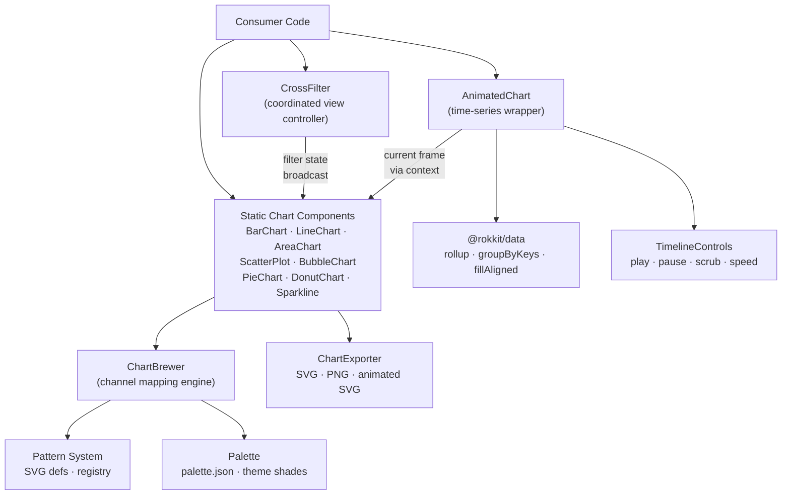
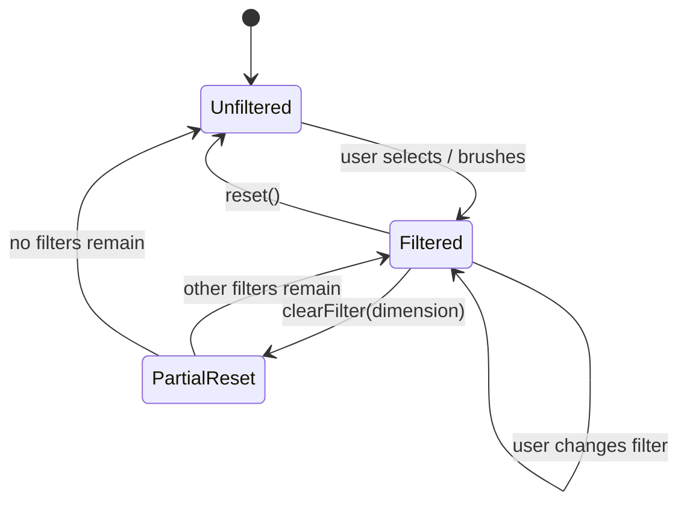

# Chart Package

> Design for `@rokkit/chart` — SVG data visualization, animated time series, cross-filtering,
> coordinated views, sparklines, brewer, and export.
>
> Implements: `docs/requirements/020-chart.md`

---

## Architecture Overview



The architecture has three independent but composable layers:

- **Rendering layer** — chart type components (BarChart, LineChart, etc.) that render a single frame of data into SVG marks.
- **Animation layer** — `AnimatedChart` wrapper that drives a time axis, tweens between keyframes, and feeds current-frame data to the rendering layer via context.
- **Coordination layer** — `CrossFilter` controller that registers multiple charts in a group and propagates filter state when any one chart is filtered.

---

## Module Structure

### Package Exports

```
@rokkit/chart
├── Sparkline               # Compact inline chart (line, bar, area)
├── BarChart                # Standalone bar chart
├── LineChart               # Standalone line chart
├── AreaChart               # Standalone area chart
├── ScatterPlot             # Standalone scatter plot
├── BubbleChart             # Scatter variant with size encoding
├── PieChart                # Pie / donut chart
├── DonutChart              # Alias for PieChart with innerRadius
├── AnimatedChart           # Time-series animation wrapper
├── TimelineControls        # Play / pause / scrub / speed UI
├── CrossFilter             # Coordinated view controller
├── ChartBrewer             # Visual channel assignment engine
├── ChartExporter           # SVG / PNG / animated SVG export
├── Plot                    # Composable primitives (Root, Axis, Bar, Grid, Legend)
├── patterns                # SVG pattern components
├── symbols                 # SVG symbol shapes
└── palette                 # palette.json — 21 colors × 11 shades
```

### File Layout

```
packages/chart/src/
├── index.js
├── charts/
│   ├── BarChart.svelte
│   ├── LineChart.svelte
│   ├── AreaChart.svelte
│   ├── ScatterPlot.svelte
│   ├── BubbleChart.svelte
│   ├── PieChart.svelte
│   └── Sparkline.svelte
├── animation/
│   ├── AnimatedChart.svelte
│   ├── TimelineControls.svelte
│   ├── keyframe-store.svelte.js
│   └── timer.svelte.js
├── crossfilter/
│   ├── CrossFilter.svelte          # Context provider + filter state
│   ├── crossfilter.svelte.js       # CrossFilter class
│   └── brush.svelte.js             # Brush interaction helpers
├── export/
│   ├── ChartExporter.svelte
│   ├── svg-export.js
│   ├── raster-export.js
│   └── animated-svg-export.js
├── lib/
│   ├── brewing/
│   │   ├── index.svelte.js         # ChartBrewer class
│   │   ├── dimensions.svelte.js
│   │   ├── scales.svelte.js
│   │   ├── bars.svelte.js
│   │   ├── axes.svelte.js
│   │   ├── legends.svelte.js
│   │   ├── brewer.svelte.js        # Visual channel assignment
│   │   └── types.js
│   ├── context.js
│   └── utils.js
├── patterns/                       # SVG pattern components (Svelte 5)
├── symbols/                        # SVG symbol shapes (Svelte 5)
├── template/                       # Template pattern library
├── Plot/                           # Composable primitives
└── palette.json                    # 21 colors × 11 shades
```

---

## Visual Channel Mapping

Every chart component uses a uniform set of semantic channel props. These are the primary interface for mapping data fields to visual properties.

### Standard Channels

| Prop      | Type                 | Description                                                                                                                            |
| --------- | -------------------- | -------------------------------------------------------------------------------------------------------------------------------------- |
| `x`       | `string`             | X-axis field. Categorical or temporal.                                                                                                 |
| `y`       | `string`             | Y-axis field. Quantitative.                                                                                                            |
| `color`   | `string`             | Series/group field for palette color assignment. One color per distinct value.                                                         |
| `fill`    | `string \| CSSColor` | Fill color channel. If a field name: pattern fill assigned per distinct value. If a CSS color string: solid fill applied to all marks. |
| `pattern` | `string`             | Pattern type channel. Assigns a distinct SVG pattern (Dots, CrossHatch, Waves, etc.) per distinct value of this field.                 |
| `size`    | `string \| number`   | Marker size channel. If a field name: encodes a quantitative dimension (bubble chart). If a number: fixed size for all marks.          |
| `symbol`  | `string`             | Symbol shape channel. Assigns a distinct marker shape per distinct value (scatter/bubble only).                                        |
| `label`   | `string`             | Field for data labels rendered on or near marks.                                                                                       |
| `time`    | `string`             | Time axis field. Used by `AnimatedChart` to define keyframes. Also accepts ISO date strings for temporal x-axis.                       |
| `z`       | `string \| number`   | Z-axis / bubble size channel. Alias for `size` in `BubbleChart`.                                                                       |

### Usage Examples

```svelte
<!-- Bar chart: color by region, dual-coded with pattern for accessibility -->
<BarChart data={salesData} x="category" y="revenue" color="region" pattern="region" />

<!-- Bubble chart: size and color as separate channels -->
<BubbleChart
  data={countries}
  x="gdpPerCapita"
  y="lifeExpectancy"
  z="population"
  color="continent"
  symbol="continent"
/>

<!-- Line chart: multiple series by color field -->
<LineChart data={timeSeries} x="date" y="value" color="metric" />

<!-- Solid fill, no field mapping -->
<BarChart data={totals} x="month" y="sales" fill="#3b82f6" />
```

### Channel Precedence

When multiple channels reference the same data field, `ChartBrewer` computes a single combined assignment:

```
color + pattern on the same field → one color and one pattern per distinct value (dual-coding)
fill as field + color as different field → fill driven by pattern, color drives palette assignment
fill as CSS string → ignores palette; all marks use that color
```

---

## ChartBrewer — Visual Channel Assignment

### Purpose

`ChartBrewer` takes data and channel props, extracts distinct values for each channel, and produces a complete visual assignment: which color, which pattern, which symbol, and which shade each data value receives. Chart components consume the brewer's output; they never perform palette or pattern logic themselves.

### Assignment Algorithm

```
Input: data, channels { x, y, color, pattern, symbol }

1. Extract distinct values per channel:
   colorValues   = unique(data.map(d => d[channels.color]))   → ['North', 'South', 'East']
   patternValues = unique(data.map(d => d[channels.pattern])) → same field, same values
   symbolValues  = unique(data.map(d => d[channels.symbol]))  → ['Widget', 'Gadget']

2. Assign palette colors (cycle through palette color names):
   'North' → blue
   'South' → rose
   'East'  → emerald

3. Select shades based on theme:
   Light mode: fill=blue-200, stroke=blue-600
   Dark mode:  fill=blue-700, stroke=blue-300

4. Assign patterns in distinctness order (most distinct first):
   'North' → Dots
   'South' → CrossHatch
   'East'  → Waves

5. Assign symbols (scatter/bubble):
   'Widget' → circle
   'Gadget' → triangle

6. Build SVG <defs> with assigned pattern + color:
   <pattern id="chart-pat-north">
     <rect fill="blue-200" />
     <Dots stroke="blue-600" />
   </pattern>
```

### Shade Selection

```javascript
const SHADE_MAP = {
  light: {
    fill: [200, 300, 100, 400], // bar fills, area fills
    stroke: [600, 700, 500], // pattern lines, borders
    text: [800, 900], // data labels — high contrast
    grid: [100, 200], // grid lines — subtle
    axis: [600, 700] // axis lines and tick text
  },
  dark: {
    fill: [700, 800, 600, 900],
    stroke: [300, 200, 400],
    text: [100, 50],
    grid: [800, 900],
    axis: [300, 400]
  }
}
```

### Pattern Assignment Order

Patterns are assigned in order of visual distinctness — the first series receives the most recognizable pattern:

1. Dots
2. CrossHatch
3. Waves
4. Brick
5. Triangles
6. Circles
7. Tile
8. OutlineCircles
9. CurvedWave

### Custom Registry

Users extend the built-in pattern and symbol registries:

```javascript
// lib/brewing/registry.svelte.js
export function createRegistry(custom = {}) {
  const {
    patterns: customPatterns = [],
    symbols: customSymbols = [],
    palette: customPalette = {}
  } = custom

  // Built-in patterns merged with custom (custom overrides on name collision)
  const patternMap = new Map(builtInPatterns)
  for (const pat of customPatterns) {
    patternMap.set(
      pat.name,
      pat.component
        ? { component: pat.component, type: 'component', defaults: pat.defaults }
        : { path: pat.path, type: 'path', size: pat.size ?? 10 }
    )
  }

  const symbolMap = new Map(builtInSymbols)
  for (const sym of customSymbols) {
    symbolMap.set(
      sym.name,
      sym.component
        ? { component: sym.component, type: 'component' }
        : { path: sym.path, type: 'path' }
    )
  }

  return { patternMap, symbolMap, palette: { ...palette, ...customPalette } }
}
```

Custom pattern components follow the same contract as built-ins: render SVG primitives inside a `size × size` tile, receive `size`, `fill`, `stroke`, `thickness` props, and never render their own `<pattern>` wrapper.

---

## CrossFilter — Coordinated Views

### Concept

`CrossFilter` enables dc.js-style interactivity: when a user filters one chart (by clicking a bar, brushing a range, or selecting a segment), every chart registered in the same group reflects that filter. Each chart always shows the full dataset but visually highlights — or dims — the filtered subset.

### Interface

```svelte
<CrossFilter data={salesData} let:filtered let:filter let:reset>
  <!-- Filtering one chart narrows the data seen by the others -->
  <BarChart data={filtered} x="region" y="revenue" onfilter={(d) => filter('region', d.region)} />

  <LineChart
    data={filtered}
    x="month"
    y="revenue"
    color="region"
    brush
    onbrush={(range) => filter('month', range)}
  />

  <PieChart
    data={filtered}
    value="count"
    label="category"
    onfilter={(d) => filter('category', d.category)}
  />

  <button onclick={reset}>Reset all filters</button>
</CrossFilter>
```

### CrossFilter State Machine



### Internal Architecture

```
CrossFilter.svelte
│
├── $state: filters = Map<dimension, FilterSpec>
│   FilterSpec = { type: 'exact' | 'range' | 'set', value: unknown }
│
├── $derived: filtered = applyFilters(data, filters)
│   Uses AND logic across all active dimensions
│
├── filter(dimension, value)   — add or replace a single-dimension filter
├── clearFilter(dimension)     — remove one dimension's filter
├── reset()                    — clear all filters
│
├── Context: setContext('crossfilter', { filtered, filter, clearFilter, reset, filters })
│
└── Exposes same API via let: bindings for non-context consumers
```

### Filter Types

```typescript
type FilterSpec =
  | { type: 'exact'; value: unknown } // bar click: region === 'North'
  | { type: 'set'; values: Set<unknown> } // multi-select: region in ['North', 'East']
  | { type: 'range'; min: unknown; max: unknown } // brush: date >= start && date <= end
  | { type: 'custom'; fn: (d: unknown) => boolean } // arbitrary predicate
```

### Chart Integration with CrossFilter

Charts read the CrossFilter context to:

1. Receive `filtered` as their working dataset.
2. Emit filter events via `onfilter` / `onbrush` which propagate to the controller.
3. Show a **reset indicator** when their dimension is active in the filter set.

Charts that do not need CrossFilter work identically — the context is optional. A chart used standalone simply omits the context read.

### Linked Selection

For highlighting rather than filtering, charts support `linkedSelection`:

```svelte
<CrossFilter data={salesData} mode="highlight" let:selection let:select>
  <!-- All charts receive the same selection object -->
  <!-- Unselected marks are dimmed, not removed -->
  <BarChart
    data={salesData}
    x="region"
    y="revenue"
    {selection}
    onselect={(d) => select(d.region)}
  />
  <LineChart data={salesData} x="month" y="value" {selection} color="region" />
</CrossFilter>
```

In `mode="highlight"`, charts dim marks outside the selection rather than filtering the data. The `selection` object is passed as a prop; each chart applies `data-dimmed` to non-matching marks.

### Drill-Down

Drill-down is a filter that narrows the visible data domain and resets when the user navigates back:

```svelte
<CrossFilter data={hierarchicalSales} let:filtered let:drillDown let:drillUp let:breadcrumb>
  <!-- breadcrumb = [{ label: 'All', level: 0 }, { label: 'North', level: 1 }] -->
  <ChartBreadcrumb {breadcrumb} onclick={drillUp} />

  <BarChart
    data={filtered}
    x="subcategory"
    y="revenue"
    onselect={(d) => drillDown({ field: 'subcategory', value: d.subcategory })}
  />
</CrossFilter>
```

---

## Brushing

### Concept

A brush is a range selection on a continuous axis. The user clicks and drags to define a start and end value. The brush emits its range via `onbrush`, which a `CrossFilter` parent can use to define a range filter.

### Enabling Brush

Any chart with a continuous x or y axis supports brushing:

```svelte
<LineChart
  data={timeSeries}
  x="date"
  y="value"
  brush="x"
  onbrush={(range) => console.log(range.min, range.max)}
/>
```

| Prop         | Values                        | Description                                         |
| ------------ | ----------------------------- | --------------------------------------------------- |
| `brush`      | `'x' \| 'y' \| 'xy' \| false` | Axis to brush. `false` disables brushing (default). |
| `brushMin`   | `unknown`                     | Controlled: current brush min value.                |
| `brushMax`   | `unknown`                     | Controlled: current brush max value.                |
| `onbrush`    | `(range) => void`             | Fires when user changes brush.                      |
| `onbrushend` | `(range) => void`             | Fires when user releases brush.                     |

### SVG Brush Implementation

```
brush.svelte.js
│
├── Renders: <rect class="brush-overlay"> — transparent, covers chart area, captures pointer events
├── Renders: <rect class="brush-selection"> — visible selection area
├── Renders: <line class="brush-handle"> × 2 — resize handles at start/end
│
├── Pointer events:
│   pointerdown on overlay → start brush at pixel position
│   pointermove            → extend brush to current pixel
│   pointerup              → commit range, emit onbrushend
│   pointerdown on handle  → resize existing brush
│
└── Scale inversion:
    pixel position → scale.invert(px) → data domain value → range object
```

---

## AnimatedChart — Time-Series Wrapper

### Component Interface

```svelte
<AnimatedChart
  data={historicalData}
  time="year"
  categoryField="language"
  duration={400}
  autoplay={false}
  loop={false}
  speed={1}
  bind:currentTime
>
  <BarChart x="language" y="pct" color="language" pattern="language" />
</AnimatedChart>
```

### Props

| Prop            | Type      | Default     | Description                                |
| --------------- | --------- | ----------- | ------------------------------------------ |
| `data`          | `any[]`   | required    | Flat data array with `time` column         |
| `time`          | `string`  | required    | Field to group keyframes by (e.g., "year") |
| `categoryField` | `string`  | —           | Field to align across frames               |
| `duration`      | `number`  | `400`       | Milliseconds per keyframe transition       |
| `autoplay`      | `boolean` | `false`     | Start playing on mount                     |
| `loop`          | `boolean` | `false`     | Loop back to start                         |
| `speed`         | `number`  | `1`         | Playback speed multiplier                  |
| `interpolate`   | `boolean` | `true`      | Tween between frames (vs. snap)            |
| `showControls`  | `boolean` | `true`      | Render `TimelineControls`                  |
| `currentTime`   | `unknown` | `$bindable` | Current time value                         |

### Internal Architecture

```
AnimatedChart.svelte
│
├── 1. Rollup Phase (on data change)
│      groupDataByKeys(data, [time], aggregators)
│      fillAlignedData(grouped, config, alignGenerator)
│      → keyframes: Map<timeValue, categoryData[]>
│      → timeValues: sorted array of distinct time values
│
├── 2. Keyframe Store (reactive)
│      $state: currentIndex = 0
│      $derived: currentTimeValue = timeValues[currentIndex]
│      tweenedData = createKeyframeStore(keyframes.get(0), { duration })
│      On index change → tweenedData.set(keyframes.get(newTimeValue))
│
├── 3. Timer (animation loop)
│      requestAnimationFrame-based
│      elapsed / (duration / speed) → currentIndex
│      Controls: play(), pause(), reset(), step(±1), seek(index)
│
├── 4. Context Provider
│      setContext('animated-chart', {
│        data: tweenedData,        ← current interpolated frame
│        timeValue: currentTimeValue,
│        playing, duration, speed
│      })
│
└── 5. Render
       <TimelineControls> (if showControls)
       <slot />           (child chart reads context)
       <time label>       (current time value display)
```

### Tweened Store for Object Arrays

```javascript
// animation/keyframe-store.svelte.js
import { tweened } from 'svelte/motion'
import { cubicOut } from 'svelte/easing'

export function createKeyframeStore(initial, options = {}) {
  const { duration = 400, easing = cubicOut } = options

  return tweened(initial, {
    duration,
    easing,
    interpolate: (from, to) => (t) =>
      to.map((toItem) => {
        const fromItem = from.find((f) => f._key === toItem._key) ?? toItem
        const result = { ...toItem }
        for (const key of Object.keys(toItem)) {
          if (typeof toItem[key] === 'number' && typeof fromItem[key] === 'number') {
            result[key] = fromItem[key] + (toItem[key] - fromItem[key]) * t
          }
        }
        return result
      })
  })
}
```

### Rank Computation (Bar Chart Race)

```javascript
function computeRanks(data, valueField) {
  const sorted = [...data].sort((a, b) => b[valueField] - a[valueField])
  return sorted.map((item, index) => ({ ...item, _rank: index }))
}
```

The `_rank` field is numeric and interpolated by the tweened store, producing smooth vertical bar repositioning as rankings change.

### prefers-reduced-motion

When `prefers-reduced-motion: reduce` is detected, `AnimatedChart`:

- Sets `duration` to `0` (instant transitions, no tweening)
- Disables autoplay
- Shows the final keyframe by default

---

## Timeline Controls

```svelte
<!-- animation/TimelineControls.svelte -->
<script>
  let {
    playing,
    currentIndex,
    totalFrames,
    speed,
    currentLabel,
    onplay,
    onpause,
    onreset,
    onstep,
    onseek,
    onspeedchange
  } = $props()
</script>

<div class="chart-timeline" role="group" aria-label="Animation controls">
  <button onclick={playing ? onpause : onplay} aria-label={playing ? 'Pause' : 'Play'}>
    <span class={playing ? 'i-lucide:pause' : 'i-lucide:play'} />
  </button>

  <button onclick={() => onstep(-1)} disabled={currentIndex === 0} aria-label="Previous frame">
    <span class="i-lucide:skip-back" />
  </button>

  <input
    type="range"
    min={0}
    max={totalFrames - 1}
    value={currentIndex}
    oninput={(e) => onseek(+e.target.value)}
    aria-label="Timeline position"
    aria-valuetext={currentLabel}
  />

  <button
    onclick={() => onstep(1)}
    disabled={currentIndex >= totalFrames - 1}
    aria-label="Next frame"
  >
    <span class="i-lucide:skip-forward" />
  </button>

  <button onclick={onreset} aria-label="Reset to beginning">
    <span class="i-lucide:rotate-ccw" />
  </button>

  <select
    value={speed}
    onchange={(e) => onspeedchange(+e.target.value)}
    aria-label="Playback speed"
  >
    <option value={0.5}>0.5×</option>
    <option value={1}>1×</option>
    <option value={2}>2×</option>
    <option value={4}>4×</option>
  </select>

  <span class="chart-timeline-label" aria-live="polite">{currentLabel}</span>
</div>
```

The `aria-live="polite"` region announces the current time label to screen readers as the animation advances.

---

## Chart Component Base Pattern

All chart types share the same structural contract.

### Common Props

```typescript
interface BaseChartProps {
  data: any[]
  width?: number
  height?: number
  margin?: { top: number; right: number; bottom: number; left: number }
  responsive?: boolean // ResizeObserver (default true)
  exportable?: boolean // Show export toolbar
  exportPosition?: 'top-right' | 'top-left' | 'bottom-right' | 'bottom-left' | 'external'
  accessible?: boolean // Pattern dual-coding (default true)
  theme?: 'light' | 'dark' | 'auto'
  title?: string // SVG <title> for screen readers
  description?: string // SVG <desc> for screen readers
  dataTable?: boolean // Render hidden <table> for screen readers
  class?: string
}

interface BarChartProps extends BaseChartProps {
  x: string // Category field
  y: string // Value field
  color?: string // Series field for color assignment
  fill?: string | CSSColor // Pattern fill field or solid color
  pattern?: string // Pattern type field
  label?: string // Data label field
  orientation?: 'vertical' | 'horizontal'
  sorted?: boolean
  barCount?: number // Max bars (bar chart race)
  brush?: false | 'x' | 'y'
  onfilter?: (datum: any) => void
  onbrush?: (range: FilterRange) => void
  selection?: SelectionState // From CrossFilter highlight mode
}

interface LineChartProps extends BaseChartProps {
  x: string // Temporal or categorical field
  y: string // Quantitative field
  color?: string // Series field
  fill?: string | CSSColor
  pattern?: string
  smooth?: boolean // Monotone cubic interpolation
  dots?: boolean // Show point markers
  brush?: false | 'x' | 'xy'
  onbrush?: (range: FilterRange) => void
}

interface ScatterPlotProps extends BaseChartProps {
  x: string // X quantitative field
  y: string // Y quantitative field
  color?: string // Color field
  fill?: string | CSSColor
  pattern?: string
  symbol?: string // Symbol shape field
  size?: string | number // Size field or fixed size
  label?: string
  brush?: false | 'xy'
  onbrush?: (range: FilterRange) => void
}

interface BubbleChartProps extends ScatterPlotProps {
  z: string // Bubble size field (alias for size)
  minSize?: number // Minimum bubble radius (px)
  maxSize?: number // Maximum bubble radius (px)
}

interface PieChartProps extends BaseChartProps {
  value: string // Quantitative field (slice size)
  label?: string // Category label field
  color?: string // Color field (defaults to label field)
  pattern?: string // Pattern field
  innerRadius?: number // 0 = pie, 0–1 = donut as fraction of outer radius
  labelPosition?: 'inside' | 'outside' | 'callout'
  onfilter?: (datum: any) => void
}

interface SparklineProps {
  data: number[] | { value: number; label?: string }[]
  type?: 'line' | 'bar' | 'area'
  value?: string | number // Headline stat
  unit?: string
  summary?: string
  trend?: 'up' | 'down' | 'flat'
  width?: number
  height?: number
  color?: string
  fillColor?: string
  showAxis?: boolean
  class?: string
}
```

### SVG Structure

All charts render inside a single `<svg>` with this layered structure:

```xml
<svg class="rokkit-chart" data-chart data-theme="light|dark"
     width="600" height="400" viewBox="0 0 600 400"
     role="img" aria-label="Chart description">

  <title>Chart Title</title>
  <desc>Detailed description for screen readers</desc>

  <!-- Pattern definitions (generated by ChartBrewer) -->
  <defs>
    <pattern id="chart-pat-0">...</pattern>
    <pattern id="chart-pat-1">...</pattern>
    <clipPath id="chart-clip-0"><rect .../></clipPath>
  </defs>

  <!-- Chart area (translated by margin) -->
  <g class="chart-area" transform="translate(50, 20)">

    <!-- Grid (bottom layer) -->
    <g class="chart-grid">
      <line ... />
    </g>

    <!-- Data marks (middle layer) -->
    <g class="chart-marks" clip-path="url(#chart-clip-0)">
      <rect fill="url(#chart-pat-0)" data-chart-mark data-key="North" ... />
    </g>

    <!-- Brush overlay (above marks) -->
    <g class="chart-brush">
      <rect class="brush-overlay" ... />
      <rect class="brush-selection" ... />
    </g>

    <!-- Axes (above marks) -->
    <g class="chart-x-axis">...</g>
    <g class="chart-y-axis">...</g>

  </g>

  <!-- Legend (outside chart area) -->
  <g class="chart-legend" transform="translate(...)">...</g>

</svg>

<!-- Accessible data table (visually hidden, screen-reader only) -->
<table class="chart-data-table sr-only" aria-label="Data for chart">...</table>

<!-- Export toolbar (HTML, positioned over SVG) -->
<div class="chart-export-toolbar">...</div>
```

### Data-Attribute Contract

Chart components follow the same data-attribute pattern as all Rokkit components:

| Attribute           | Element                                         | Description                                      |
| ------------------- | ----------------------------------------------- | ------------------------------------------------ |
| `data-chart`        | Root `<svg>`                                    | Component identity marker                        |
| `data-chart-mark`   | Each data mark (`<rect>`, `<circle>`, `<path>`) | Navigable, filterable mark                       |
| `data-chart-axis`   | Axis `<g>`                                      | Axis container                                   |
| `data-chart-legend` | Legend `<g>`                                    | Legend container                                 |
| `data-chart-brush`  | Brush overlay `<g>`                             | Brush interaction area                           |
| `data-key`          | Each mark                                       | The data field value this mark represents        |
| `data-focused`      | Mark                                            | Keyboard focus state                             |
| `data-selected`     | Mark                                            | Selected/active state                            |
| `data-dimmed`       | Mark                                            | Dimmed by CrossFilter highlight mode             |
| `data-filtered`     | Root `<svg>`                                    | Present when any CrossFilter dimension is active |
| `data-theme`        | Root `<svg>`                                    | `"light"` or `"dark"`                            |

---

## Accessibility

### Keyboard Navigation

Charts with data marks support keyboard navigation:

```
Tab                → focus chart container
ArrowLeft/Right    → previous/next data mark (bar, slice, point)
ArrowUp/Down       → increase/decrease value in editable charts (future)
Enter / Space      → select/filter the focused mark
Escape             → clear selection / exit brush mode
Home / End         → first / last mark
```

Navigation is implemented by the standard `use:navigator` action applied to the chart marks container, with marks carrying `data-path` attributes. This reuses the same navigator infrastructure as all Rokkit selection components.

```svelte
<!-- Inside BarChart.svelte -->
<g class="chart-marks" use:navigator={{ controller, orientation: 'horizontal' }}>
  {#each bars as bar, i}
    <rect
      data-chart-mark
      data-path={String(i)}
      data-key={bar.key}
      data-focused={controller.focusedKey === String(i) ? '' : undefined}
      role="img"
      aria-label="{bar.key}: {bar.value}"
      tabindex="-1"
      ...
    />
  {/each}
</g>
```

### Screen Reader Annotations

Every chart SVG includes:

```xml
<svg role="img" aria-label="Bar chart: Revenue by Region">
  <title>Revenue by Region</title>
  <desc>
    Bar chart showing revenue across 4 regions. North: $1.2M (highest).
    South: $0.9M. East: $0.7M. West: $0.6M.
  </desc>
  ...
</svg>
```

`<title>` and `<desc>` are always present. The `description` prop allows a consumer-provided narrative; if omitted, the chart generates a summary from the data (top value, range, count of marks).

### Data Table Alternative

When `dataTable={true}`, the chart renders a visually-hidden `<table>` that presents the chart data in tabular form. Screen reader users can navigate the table instead of (or in addition to) the SVG. The table is present in the DOM but hidden with the `.sr-only` utility class:

```svelte
{#if dataTable}
  <table class="chart-data-table sr-only" aria-label="Data table for: {title}">
    <caption>{title}</caption>
    <thead>
      <tr>
        <th scope="col">{x}</th>
        <th scope="col">{y}</th>
        {#if color}<th scope="col">{color}</th>{/if}
      </tr>
    </thead>
    <tbody>
      {#each data as row}
        <tr>
          <td>{row[x]}</td>
          <td>{row[y]}</td>
          {#if color}<td>{row[color]}</td>{/if}
        </tr>
      {/each}
    </tbody>
  </table>
{/if}
```

### Animated Chart Announcements

When `AnimatedChart` advances to a new keyframe:

```svelte
<span class="sr-only" role="status" aria-live="polite" aria-atomic="true">
  {currentTimeLabel}: {topItem.name} leads with {topItem.value}
</span>
```

This live region announces the current frame context without overwhelming the user with every interpolation step — it fires only when the index advances.

### Pattern Dual-Coding

Every data series receives both a unique color and a unique pattern (Dots, CrossHatch, Waves, etc.). This ensures:

- Color-blind users distinguish series by texture
- Printed output (grayscale) remains legible
- High-contrast mode users can identify marks by pattern alone

---

## Theme Integration

### CSS Variables

Charts consume the Rokkit theme variable system:

```css
/* packages/themes/src/base/chart.css */

[data-chart] {
  --chart-bg: var(--surface-1, #ffffff);
  --chart-text: var(--text-1, #1a1a2e);
  --chart-text-muted: var(--text-2, #6b7280);
  --chart-grid: var(--border-1, #e5e7eb);
  --chart-axis: var(--text-2, #4b5563);
  --chart-selection: var(--color-primary-z4);
  --chart-brush: var(--color-primary-z2);
  --chart-brush-border: var(--color-primary-z6);
  --chart-dimmed: 0.2; /* opacity for non-selected marks in highlight mode */
}
```

Dark mode is automatic via the theme's z-index inversion system — no conditional logic in chart CSS.

### Palette and Theme Shades

The `ChartBrewer` selects palette shades appropriate to the current theme mode (`light` or `dark`). The `theme` prop accepts `'auto'` (default), which reads the current `data-mode` attribute from the nearest ancestor, matching the Rokkit skin system.

### Theme-Per-Chart

Each chart can override its own theme:

```svelte
<BarChart {data} x="month" y="revenue" theme="dark" />
```

This renders the chart with dark-mode shades regardless of the page-level theme. Useful for charts on dark card surfaces within a light-mode page.

### Component CSS

```css
/* Timeline controls */
.chart-timeline {
  display: flex;
  align-items: center;
  gap: 0.5rem;
  padding: 0.5rem;
}

.chart-timeline input[type='range'] {
  flex: 1;
}

.chart-timeline-label {
  font-size: 0.875rem;
  font-variant-numeric: tabular-nums;
  min-width: 4ch;
}

/* Export toolbar — appears on hover */
.chart-export-toolbar {
  position: absolute;
  display: flex;
  gap: 0.25rem;
  opacity: 0;
  transition: opacity 150ms ease;
}

[data-chart]:hover .chart-export-toolbar,
.chart-export-toolbar:focus-within {
  opacity: 1;
}

/* Brush */
.brush-overlay {
  fill: transparent;
  cursor: crosshair;
}
.brush-selection {
  fill: var(--chart-brush);
  stroke: var(--chart-brush-border);
  stroke-width: 1;
}

/* Dimming in highlight mode */
[data-chart-mark][data-dimmed] {
  opacity: var(--chart-dimmed);
}

/* Sparkline */
.sparkline {
  display: inline-flex;
  flex-direction: column;
  gap: 0.25rem;
}

.sparkline-stat {
  display: flex;
  align-items: baseline;
  gap: 0.25rem;
  font-weight: 600;
}

.sparkline-trend[data-trend='up'] {
  color: var(--color-success, #22c55e);
}
.sparkline-trend[data-trend='down'] {
  color: var(--color-danger, #ef4444);
}
.sparkline-trend[data-trend='flat'] {
  color: var(--chart-text-muted);
}

/* Reduced motion */
@media (prefers-reduced-motion: reduce) {
  [data-chart] * {
    transition-duration: 0ms !important;
    animation: none !important;
  }
}
```

---

## Sparkline Design

### Component

```svelte
<!-- charts/Sparkline.svelte -->
<script>
  let {
    data,
    type = 'line',
    value,
    unit,
    summary,
    trend,
    width = 200,
    height = 60,
    color = 'currentColor',
    fillColor,
    showAxis = false,
    class: className,
    ...restProps
  } = $props()
</script>

<div class="sparkline {className}" {...restProps}>
  {#if value != null}
    <div class="sparkline-stat">
      {#if trend}
        <span class="sparkline-trend" data-trend={trend}>
          <span
            class={trend === 'up'
              ? 'i-lucide:trending-up'
              : trend === 'down'
                ? 'i-lucide:trending-down'
                : 'i-lucide:minus'}
          />
        </span>
      {/if}
      <span class="sparkline-value">{value}</span>
      {#if unit}<span class="sparkline-unit">{unit}</span>{/if}
    </div>
  {/if}

  <svg
    {width}
    {height}
    viewBox="0 0 {width} {height}"
    role="img"
    aria-label={summary ?? 'Sparkline chart'}
    aria-hidden={!summary}
  >
    {#if type === 'line'}
      <SparklineLine {data} {width} {height} {color} fill={fillColor} />
    {:else if type === 'bar'}
      <SparklineBar {data} {width} {height} {color} />
    {:else if type === 'area'}
      <SparklineArea {data} {width} {height} {color} fill={fillColor} />
    {/if}
  </svg>

  {#if summary}
    <p class="sparkline-summary">{summary}</p>
  {/if}
</div>
```

### Scale Computation

Sparklines compute inline scales without ChartBrewer (no axes, no legend):

```javascript
function sparklineScale(data, width, height, padding = 2) {
  const values = data.map((d) => (typeof d === 'number' ? d : d.value))
  const min = Math.min(...values)
  const max = Math.max(...values)
  const range = max - min || 1
  return {
    x: (i) => padding + (i / (values.length - 1)) * (width - padding * 2),
    y: (v) => height - padding - ((v - min) / range) * (height - padding * 2),
    values
  }
}
```

---

## SVG Export

### Static SVG (`svg-export.js`)

```javascript
export function exportSvg(svgElement, filename = 'chart.svg') {
  const clone = svgElement.cloneNode(true)
  inlineStyles(clone, svgElement)
  clone.setAttribute('xmlns', 'http://www.w3.org/2000/svg')
  clone.setAttribute('xmlns:xlink', 'http://www.w3.org/1999/xlink')
  const svgString = new XMLSerializer().serializeToString(clone)
  const blob = new Blob([svgString], { type: 'image/svg+xml;charset=utf-8' })
  downloadBlob(blob, filename)
}
```

### Raster Export (`raster-export.js`)

```javascript
export async function exportRaster(svgElement, format = 'png', scale = 2, filename) {
  const svgString = new XMLSerializer().serializeToString(svgElement)
  const svgBlob = new Blob([svgString], { type: 'image/svg+xml' })
  const url = URL.createObjectURL(svgBlob)
  const img = new Image()
  img.src = url
  await new Promise((resolve) => {
    img.onload = resolve
  })
  const canvas = document.createElement('canvas')
  canvas.width = svgElement.clientWidth * scale
  canvas.height = svgElement.clientHeight * scale
  const ctx = canvas.getContext('2d')
  ctx.scale(scale, scale)
  ctx.drawImage(img, 0, 0)
  URL.revokeObjectURL(url)
  const mimeType = format === 'jpeg' ? 'image/jpeg' : 'image/png'
  canvas.toBlob(
    (blob) => downloadBlob(blob, filename ?? `chart.${format}`),
    mimeType,
    format === 'jpeg' ? 0.92 : undefined
  )
}
```

### Animated SVG Export (`animated-svg-export.js`)

Generates standalone animated SVG using SMIL `<animate>` elements:

```javascript
export function exportAnimatedSvg(chartElement, keyframes, options = {}) {
  const {
    duration = keyframes.length * 0.4, // total seconds
    repeatCount = 'indefinite',
    filename = 'animated-chart.svg'
  } = options

  const totalDur = `${duration}s`
  const keyTimes = keyframes.map((_, i) => (i / (keyframes.length - 1)).toFixed(4)).join(';')

  // For each bar/series: collect values across frames, emit <animate> per attribute
  // ...build SVG with SMIL animations
}
```

SMIL structure per animated bar:

```xml
<rect x="0" width="100" height="30">
  <animate attributeName="width"
           values="100;150;120;200"
           keyTimes="0;0.333;0.667;1"
           dur="4s"
           repeatCount="indefinite" />
  <animate attributeName="y"
           values="0;30;0;60"
           keyTimes="0;0.333;0.667;1"
           dur="4s"
           repeatCount="indefinite" />
</rect>
```

### Export Toolbar

```svelte
<!-- ChartExporter.svelte — rendered as HTML overlay positioned over the SVG -->
<div class="chart-export-toolbar" data-chart-toolbar>
  <button onclick={() => exportSvg(svgRef)} aria-label="Download SVG">
    <span class="i-lucide:download" /> SVG
  </button>
  <button onclick={() => exportRaster(svgRef, 'png')} aria-label="Download PNG">
    <span class="i-lucide:image" /> PNG
  </button>
  {#if animated}
    <button onclick={() => exportAnimatedSvg(svgRef, keyframes)} aria-label="Download animated SVG">
      <span class="i-lucide:film" /> Animated
    </button>
  {/if}
</div>
```

---

## Data Integration with @rokkit/data

### Rollup for Animation Keyframes

`AnimatedChart` uses `@rokkit/data` rollup functions to group flat data into aligned keyframes:

```javascript
import { groupDataByKeys, fillAlignedData, getAlignGenerator } from '@rokkit/data'

function buildKeyframes(data, timeField, categoryField, valueField) {
  const grouped = groupDataByKeys(
    data,
    [timeField],
    [
      {
        mapper: (row) => row,
        reducers: [{ field: '_items', formula: (arr) => arr }]
      }
    ]
  )
  grouped.sort((a, b) => (a[timeField] < b[timeField] ? -1 : 1))
  const allCategories = [...new Set(data.map((d) => d[categoryField]))]
  return grouped.map((frame) => ({
    time: frame[timeField],
    data: allCategories.map((cat) => {
      const item = frame._items.find((i) => i[categoryField] === cat)
      return item ?? { [categoryField]: cat, [valueField]: 0, _filled: true }
    })
  }))
}
```

### Rollup Prop

For consumers who want more control, `AnimatedChart` accepts a `rollup` configuration:

```svelte
<AnimatedChart
  {data}
  time="month"
  rollup={{
    groupBy: ['month'],
    summaries: [
      {
        mapper: (row) => row.revenue,
        reducers: [{ field: 'totalRevenue', formula: (arr) => arr.reduce((a, b) => a + b, 0) }]
      }
    ],
    alignBy: ['category']
  }}
>
  <BarChart x="category" y="totalRevenue" />
</AnimatedChart>
```

---

## Pattern System (Svelte 5 Migration)

### Migration Pattern

All 9 pattern components are Svelte 4 (`export let`, `$:`) and require migration:

```svelte
<!-- Before (Svelte 4) -->
<script>
  export let size = 10
  export let stroke = 'currentColor'
  $: r = size / 4
</script>

<!-- After (Svelte 5) -->
<script>
  let { size = 10, stroke = 'currentColor' } = $props()
  let r = $derived(size / 4)
</script>
```

### Pattern Registration in SVG Defs

`ChartBrewer` generates `<defs>` entries automatically:

```svelte
<defs>
  {#each brewer.getPatternDefs() as pat}
    <pattern id={pat.id} patternUnits="userSpaceOnUse" width={pat.size} height={pat.size}>
      <rect width={pat.size} height={pat.size} fill={pat.fillColor} />
      <svelte:component
        this={pat.component}
        size={pat.size}
        fill={pat.fillColor}
        stroke={pat.strokeColor}
      />
    </pattern>
  {/each}
</defs>
```

---

## Implementation Phases

### Phase 1 — Foundation

- [ ] Migrate all pattern/symbol/texture components to Svelte 5
- [ ] Move `palette.json` from `old_lib/` to `src/`
- [ ] Create `VisualBrewer` class (pattern + color + symbol assignment from channels)
- [ ] Create `Sparkline` component (line, bar, area)
- [ ] Create `ChartExporter` (static SVG + PNG export)
- [ ] Base chart CSS (variables, sparkline, toolbar, reduced-motion)

### Phase 2 — Static Chart Components

- [ ] `BarChart` (vertical + horizontal, grouped, stacked)
- [ ] `LineChart` (single + multi-series, smooth option)
- [ ] `AreaChart` (single + stacked)
- [ ] `ScatterPlot` (symbol assignment, size channel)
- [ ] `BubbleChart` (z-channel for size)
- [ ] `PieChart` / `DonutChart` (segment labels, inner radius)
- [ ] Unit tests for each chart type

### Phase 3 — Interactivity

- [ ] `CrossFilter` coordinated view controller
- [ ] Brush interaction (`brush.svelte.js`) for LineChart and ScatterPlot
- [ ] CrossFilter highlight mode (linked selection / dimming)
- [ ] Drill-down navigation with breadcrumb
- [ ] Chart keyboard navigation via `use:navigator` on marks
- [ ] Data table alternative (`dataTable` prop)

### Phase 4 — Animation

- [ ] `AnimatedChart` wrapper with keyframe store
- [ ] `TimelineControls` (play/pause/scrub/speed/loop)
- [ ] Timer system (requestAnimationFrame-based)
- [ ] Custom array-of-objects tweened interpolator
- [ ] Rank computation for bar chart race
- [ ] `prefers-reduced-motion` support
- [ ] Animated SVG export (SMIL `<animate>`)

### Phase 5 — Polish and Advanced Features

- [ ] Canvas fallback for scatter plots with 10,000+ points
- [ ] Custom easing functions for animations
- [ ] High-contrast theme variant
- [ ] Playground pages and learn-site stories for all chart types
- [ ] Remove `ramda` dependency (backlog #23)
- [ ] Remove `bits-ui` dependency (backlog #25)
- [ ] Accessibility audit (ARIA, keyboard, screen reader)

---

## Cross-References

- Requirements: `docs/requirements/020-chart.md`
- Existing chart code: `packages/chart/src/`
- Data rollup: `packages/data/src/rollup.js`
- Pattern library: `packages/chart/src/patterns/`
- Symbol library: `packages/chart/src/symbols/`
- Palette: `packages/chart/src/old_lib/palette.json`
- Brewer (legacy): `packages/chart/src/old_lib/brewer.js`
- Backlog #23 (ramda removal): `docs/backlog/`
- Backlog #25 (bits-ui removal): `docs/backlog/`
- Backlog #58 (Svelte 4→5 pattern migration): `docs/backlog/`
- dc.js cross-filter reference: https://dc-js.github.io/dc.js/
