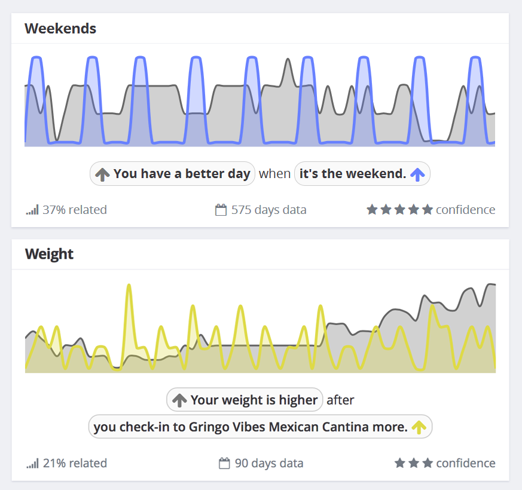
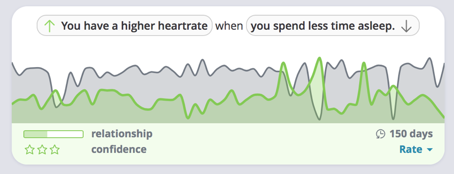
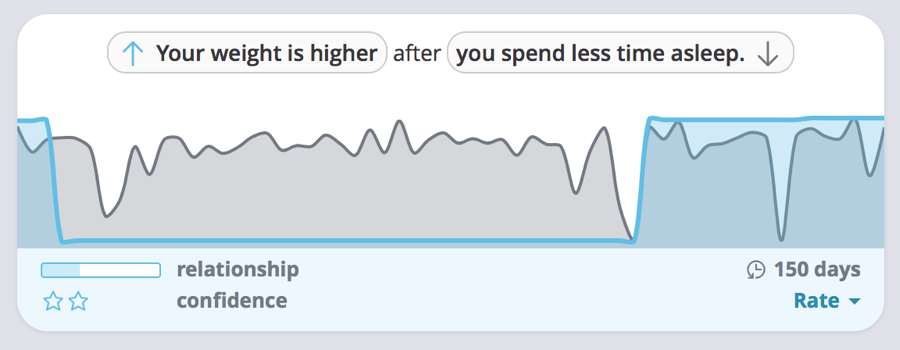

# Plots

- BoxPlot
- ViolinPlot
- ScatterPlot
- FunnelPlot
- Correlation

## Correlation

Compare two data points across time and show the correlation between them.

Examples below from [exist.io]

